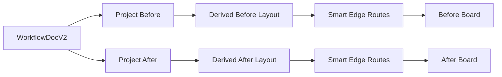

<!-- Canonical build plan for the Automation Pitch relay. Generated verbatim from the approved Cursor plan on 2026-09-06. Change only with user approval; record every change in .docs/handoff.md and, for contract clauses, under Amendments in .docs/GOAL.md. -->

# Automation Pitch: Frozen Build Relay

## 0. Execution model

- The user is the coordinator. Each slice runs in a **fresh Cursor chat** started by pasting the kickoff prompt from Section 4 with the slice number filled in. One slice per chat; never two slices in parallel.
- The slice agent implements, tests, saves evidence, appends a handoff entry, summarizes, and **waits**. It commits only after the user replies `approved — commit`, then appends the approval line and commits with the fixed message format.
- `.docs/BUILD_PLAN.md` is the canonical plan and `.docs/GOAL.md` is the canonical contract. Both were generated from this plan during planning, together with `.docs/handoff.md` and `.cursor/rules/agent-handoff.mdc`, and are committed with the baseline in Slice 0. Agents never read `.cursor/plans/`.
- The contract is frozen, not immutable: when an agent stops and asks and the user decides, the user (or the same agent on the user's instruction) appends a dated entry to the **Amendments** section at the end of `.docs/GOAL.md`, citing clause IDs. Original clauses are never edited in place.

## 1. Authorization and baseline

This plan is approved for planning only. No implementation begins until the user explicitly asks to execute it, starting with Slice 0.

Known baseline facts (verified against the working tree on 2026-09-06):

- Branch is `main` with a single commit (`Initial commit`, README only). Every application file is untracked, so there is no reliable historical diff. A GitHub remote exists; nothing is pushed by this relay.
- `npx tsc --noEmit` passes on the current tree.
- The UI kit is Mantine 9 (`@mantine/core`, `@mantine/hooks`) with `@tabler/icons-react`; state is Zustand 5; canvas is `@xyflow/react` 12; build is Vite 8 + TypeScript 7 (`npm run build` = `tsc --noEmit && vite build`).
- The app already contains: Human Role editing, [`auto-text-size`](package.json) with [`FitLabel`](src/tiles/FitLabel.tsx), light/dark theme (hamburger toggle, `data-theme`, [`tokens.css`](src/visual/tokens.css)), Present mode (hamburger first item; hides the inspector, forces the Hand tool, shows the score in the top bar, Space toggles Before/After), a Pointer/Hand tool toggle and Undo in the upper-left, and a rebindable keymap ([`bindings.ts`](src/keyboard/bindings.ts), [`KeybindsModal.tsx`](src/keyboard/KeybindsModal.tsx)) whose default single-key Undo is **Backspace**.
- The app contains **no sound or audio code** and no Step/Data toolbar buttons (the palette and actor inventory rail were already removed).
- Hamburger order today: Present, Demo, New, Import, Keybinds, Light/Dark mode.
- [`src/state/store.ts`](src/state/store.ts) combines persistence, history (80 snapshots), graph edits, interaction booleans (`linkFrom`, `linkMenu`, `pathPick`), demos, and selection. `connect` blocks only self-loops and duplicates, so saved v1 boards may contain cycles, multiple roots, or orphan Nodes.
- [`spreadForLabels`](src/board/pathGeometry.ts) mutates saved Node positions inside `commit`; it does not contract.
- [`WorkflowDoc`](src/model/types.ts) is version 1 with two assignment lanes (`assignments.before`, `assignments.after`), Step `split` (exclusive/parallel), optional per-Path `dashed`, and a `stub` flag. Startup falls back destructively to the demo and overwrites storage.
- [`scripts/export.mjs`](scripts/export.mjs) duplicates the Oak Park demo with deterministic IDs (`h_alice`, `s_read`, `e_gt`, ...); reuse those IDs when the fixture is made deterministic, then delete the script.
- A stray `abandoned-version/` folder in the repo root contains only an ignored `node_modules`.
- There is no unit, browser, accessibility, or visual regression suite.

## 2. Frozen definition of success

This section is mirrored verbatim in `.docs/GOAL.md`, which ends with an `## Amendments` section. Implementing agents never edit clauses. Handoff entries cite clause IDs.

### Product (P)

- **P-01** Automation Pitch is a responsive, self-explaining desktop workflow board for comparing a human-heavy Before process with a more automated After process. It uses an original chunky, playful visual and audio language; it does not copy Nintendo assets, sounds, typefaces, marks, or game interfaces.
- **P-02** A first-time user can create, label, connect, remove, compare, merge, unmerge, save, and load without hidden graph knowledge.
- **P-03** Interactions remain smooth with about 30 total Nodes and Paths on supported screens.
- **P-04** The supported viewport is desktop/laptop at least 1024 CSS pixels wide. Smaller viewports show a clear unsupported-view message instead of a broken board.
- **P-05** The approved top bar, right inspector, and hamburger placement remain. No new permanent panel is introduced except the small After merge dock. The right inspector may widen to at most 320 px; no other approved surface moves.
- **P-06** The generic idle helper chips disappear. Contextual hints appear only while a selection or active task needs guidance.
- **P-07** Present mode remains as the first hamburger item. Present hides the inspector, NodeToolbars, merge dock, and contextual hints; disables all editing; shows the automation score in the top bar; Space toggles Before/After. Exiting Present restores the previous view and selection state.
- **P-08** The Pointer/Hand tool toggle is removed. Panning is drag on empty canvas, scroll/pinch zoom, and the pan keys. The upper-left group becomes Undo and the sound toggle.
- **P-09** Light and dark themes remain (hamburger toggle). Every new or restyled surface is legible and passes contrast in both.
- **P-10** Mantine 9 and Tabler icons remain the only UI kit and icon set.

### Workflow graph (WG)

- **WG-01** A brand-new board contains zero Nodes and the default actor roster (Alice, Roy, Jack, Missy, Robot). Its obvious empty-state action is **Add Step**, which creates the root assigned to the default Human.
- **WG-02** The first Step becomes the sole root. Every nonempty document has exactly one root. The root has no incoming Paths; a connection into the root is rejected.
- **WG-03** The workflow is a connected directed acyclic graph. Every Node is reachable from the root; reconvergence and multiple incoming Paths are allowed.
- **WG-04** A proposed connection that would create a cycle, duplicate an existing Path, or violate the root/reachability rules is rejected before mutation with a concise visible explanation.
- **WG-05** Paths are editable relationships, not independently removable objects. Selecting a Path and pressing Delete explains that the user must remove a Node and that the workflow will be reconnected. Backspace is not a removal key; it remains Undo.
- **WG-06** The root Node cannot be removed. The UI explains why and recommends New for a clean board.
- **WG-07** `+` opens Step, Data, and Connect existing. Clicking empty canvas while linking cancels the link; it never creates an implicit Node.
- **WG-08** `−`, the Delete key, and the inspector Remove button enter the same Node-removal picker. The current Node and its directly connected Nodes are valid candidates subject to graph rules. Removal always requires an explicit confirmation (Enter or click) inside the picker.
- **WG-09** For every entry point the first outgoing child is preselected; a leaf defaults to itself. Keyboard focus and a strong but tasteful visual highlight follow that default. Up/Down move between candidates; Escape cancels.
- **WG-10** Removing a Node never leaves an unreachable Node. One predecessor with one successor reconnects automatically. One predecessor with many successors, or many predecessors with one successor, reconnects automatically as a full fan.
- **WG-11** If the removed Node has two or more predecessors and two or more successors, the UI previews deterministic nearest visual pairings (vertical distance, then horizontal, then ID). The user may adjust pairings; a pairing set is valid only if every successor keeps at least one incoming Path. Confirmation applies that exact plan atomically.
- **WG-12** When two removed-adjacent Paths collapse into one, trimmed nonempty conditions are preserved in traversal order and joined with ` + `. Empty values do not produce stray separators. If the collapsed Path would duplicate an existing Path, the existing Path is kept and the conditions are joined into it by the same rule.
- **WG-13** A structural create, connect, remove, merge, or unmerge is one undo step. Text remains one undo step per committed keystroke, as explicitly chosen. History holds 500 entries. Undo and redo never change the active view.

### Paths, conditions, and strokes (PC)

- **PC-01** A Path's stroke carries meaning: **solid** means the Path is always visited; **dotted** means the Path is a choice (one of several).
- **PC-02** A Step's Split sets the default stroke of its outgoing Paths: **One of** (stored `exclusive`) makes every outgoing Path dotted; **Every** (stored `parallel`) makes every outgoing Path solid. A Step with a single outgoing Path draws it solid regardless.
- **PC-03** A Path may override its stroke individually (Always visited / Choice) so one Step can mix an always-visited Path with a set of choices. Changing the Step's Split re-applies the default to every outgoing Path.
- **PC-04** A collapsed Path (WG-12) is dotted if any Path it replaces was dotted; otherwise solid.
- **PC-05** Stroke and Split survive migration, projection (merged internals and projected boundary Paths included), and Smart Edge rendering.
- **PC-06** Demo fixtures follow PC-01: both Oak Park amount conditions are choices and therefore dotted.

### Nodes, actors, text, and inspector (NA)

- **NA-01** Human actors have editable Name, Color, and Role. Robot actors have editable Name, Color, and Type (LLM / Agent / Script).
- **NA-02** Actors may be deleted only when unused in either lane, including After-only Steps. A blocked deletion identifies the assigning Steps.
- **NA-03** Robots may be assigned in Before (an existing workflow may already be partly automated). New Before-origin Steps default to the last-used Human, else Alice, else the first Human, in both lanes, so a new Step is not automated until its After Who changes. After-only Steps default to the default Robot.
- **NA-04** The default Robot is the first Robot on the roster. If no Robot exists when After needs one (merge or After-only Step), a Robot named "Robot" of Type Script is created automatically inside the same undo step.
- **NA-05** Step Type uses alphabetical fat buttons with Other last. Who uses accessible Human/Robot actor icon buttons; every actor is offered in both lanes.
- **NA-06** Who assigns on primary click. A compact Manage actors action edits, adds, and deletes actors in the same right inspector; the removed inventory rail is not recreated.
- **NA-07** The inspector calls an edge **Path / condition**, never Arrow/label. The stroke control reads "Always visited (solid) / Choice (dotted)"; the Step control reads "Split: One of / Every".
- **NA-08** Enter on a selected Path or Data Node focuses its primary naming field and selects the current value. Enter on a Step does not guess among fields.
- **NA-09** Native Tab and Shift+Tab order remains complete and logical across visible controls; closed/inert controls are skipped.
- **NA-10** Actor name/role, Data label, Step title, and Step detail wrap and shrink only to a readable minimum, then clamp with ellipsis and expose the full value accessibly.
- **NA-11** The old actor paintbrush assignment mode (select an actor, then click Steps) is removed; Who buttons are the single assignment interaction.
- **NA-12** The inspector has no Path delete control. Its Node Remove button enters the WG-08 picker.

### Canvas experience (CX)

- **CX-01** Tile-local controls use React Flow `NodeToolbar` so hit targets are not covered by drag surfaces.
- **CX-02** Condition labels remain clickable at all zoom levels and do not accidentally trigger edge selection.
- **CX-03** Path routing avoids Node rectangles and reduces collisions through `@tisoap/react-flow-smart-edge` v5, preserving the approved orthogonal/stepped look and dotted strokes.
- **CX-04** Label placement is a custom deterministic stage after routing: choose the clearest segment, avoid Nodes and previously placed labels, then wrap/clamp within an explicit maximum width.
- **CX-05** Label-aware spacing is derived for each rendered lane and excluded from the saved document and undo history. Long labels may expand the lane; shortening them contracts it smoothly back toward canonical positions.
- **CX-06** Node removal has a quick squash/pop animation and a connector-stretch restitch animation. `prefers-reduced-motion` receives an immediate, non-flashing equivalent.
- **CX-07** Selection, hover, focus, keyboard focus, removal candidacy, and proposed restitches are distinguishable without relying on color alone.
- **CX-08** Empty-canvas click cancels any transient canvas interaction and clears selection. Escape always returns to idle.

### Before, After, and Both (BA)

- **BA-01** Workflow document version 2 stores one shared base workflow plus an After overlay containing After assignments, merge groups, After-only Steps, and After-only Paths.
- **BA-02** Before-origin field values (Step Type, title, detail, Data label, conditions, strokes, Split, positions) are shared. Editing one from Before or After updates the same base value, reflected immediately in both views and inside merged internals. Who is lane-specific by design and is the only per-lane value on a Before-origin Step.
- **BA-03** Before is the only view that may remove a Before-origin non-root Node.
- **BA-04** After may not remove Before-origin Steps; it represents them individually or in merge groups. `−`/Delete on a Before-origin Step in After explains this; on a merged tile it offers Unmerge.
- **BA-05** Both is read-only comparison: no NodeToolbars, no merge dock, no inspector editing. Before and After have independent pan/zoom viewports. Pan keys act on the lane that last received pointer or keyboard focus.
- **BA-06** In After, `+` offers After-only Step and Connect existing; `+ Data` is not offered. Connect existing in After creates an After-only Path, which may join any two Nodes visible in After (base or After-only), subject to WG-04 evaluated on the After projection. After-only Paths never appear in Before.
- **BA-07** After-only Steps default to the default Robot, exist only in After, are never merge members, and may be removed in After through the same picker; reconnection applies the WG-10..12 rules to After-only Paths on the After projection.
- **BA-08** After-only Steps are omitted entirely from the automation score. The score counts Before-origin Steps whose Before actor is not a Robot and whose After actor is a Robot, counting merged members individually rather than one giant tile.
- **BA-09** Removing a Before-origin Node also removes After-only Paths touching it and reconnects on the After projection by the same fan rules so no After-only Step becomes unreachable; merge groups are pruned per MG-10.

### Merge groups (MG)

- **MG-01** The merge dock appears only in editable After view. It uses Merge and Unmerge buttons with compact guidance.
- **MG-02** A group contains one or more Before-origin Steps. Data Nodes and After-only Steps cannot be selected as members.
- **MG-03** A selection expands to its closure: every Node on a base path between two selected Steps is included, Steps as members and Data Nodes as supporting internals. The expanded group is previewed before confirmation.
- **MG-04** A group must be convex: no base path may leave the group and re-enter it. Closure expansion makes any connected selection convex. A selection whose Steps are not connected by base paths is rejected with an explanation.
- **MG-05** Selecting a Step already in a group plus additional Steps extends that group; selecting members from multiple groups flattens them into one group. Nested groups are never created.
- **MG-06** A merge group uses the default Robot. Choosing another Who for the giant Step updates every swallowed Step.
- **MG-07** Unmerge restores the entire group; partial unmerge is not supported. Member robot assignments remain after unmerge.
- **MG-08** A merged tile displays a compact, scroll-free internal flow using icon plus title/target, condition branching, and strokes, without System/detail text. The Robot figure stays normal size.
- **MG-09** External Paths are projected through the merged tile without rewriting the base graph. Conditions remain attached to their underlying Paths. Distinct parallel boundary Paths keep their own conditions.
- **MG-10** A Before connection that would break an existing group's convexity is rejected with an explanation naming the group (unmerge first). A residual group left noncontiguous by a Before removal dissolves with a notice. A group dissolves when no member remains.

### Shell, demos, sound, and data safety (SH)

- **SH-01** The shell becomes more contrast-rich and chunky without moving approved controls or adding decorative UI, in both themes.
- **SH-02** Before/After/Both is visually prominent, keyboard accessible, and keeps the existing Before/After/Both information architecture.
- **SH-03** Sound is a new feature, off by default. The upper-left sound toggle (after Undo) turns locally synthesized UI feedback on or off, persists the preference, and has a visible and announced state.
- **SH-04** Cues are original Web Audio synthesis at a fixed low volume, never copied samples: soft blip for create/connect, pop for remove, low buzz for a rejected action, two-note for merge/unmerge, tick when sound is turned on. Reduced-motion users may still use sound; sound remains independently controllable.
- **SH-05** The hamburger keeps Present, New, Import, Keybinds, and Light/Dark mode in place. Demo becomes a chooser (Oak Park Invoice, Robot Mailroom) and moves to the bottom. No Export item is added.
- **SH-06** New, Demo, and Import share a Save copy / Discard / Cancel gate before replacing the current document.
- **SH-07** The two demos are Oak Park Invoice and Robot Mailroom (Appendix A). Robot Mailroom is a compact showcase with a preconfigured merge and an After-only Robot Step. Demo IDs are deterministic; user-created IDs are collision-safe.
- **SH-08** Saved and imported JSON is validated at runtime with Zod 4. Valid version 1 data migrates deterministically to version 2.
- **SH-09** A version 1 document whose graph violates WG-02..WG-04 (multiple roots, unreachable Nodes, cycles) is not repaired. It is rejected into recovery with a list of the specific violations.
- **SH-10** If saved browser data cannot migrate, its raw value is preserved under its original key and never overwritten. The user sees Download recovery copy and Start fresh.
- **SH-11** If localStorage fails, editing continues in memory and one persistent unobtrusive Not saved warning appears until a successful save.
- **SH-12** Successful New, Demo, and Import clear undo/redo history so Undo cannot cross document boundaries.
- **SH-13** The duplicate `export-json` CLI and its README instructions are removed; Save copy is the supported JSON download.
- **SH-14** The existing rebindable Keybinds catalog remains the single source for single-key actions and the Keybinds modal. Backspace stays Undo. Pointer/Hand actions are retired; detach becomes Remove Node (`-`), path-confirm becomes Confirm (Enter); Merge (`m`) and Unmerge (`u`) are added. Saved keymaps ignore unknown or retired actions.
- **SH-15** Nunito is bundled locally and the Google Fonts link is removed.

### Accessibility and quality (AQ)

- **AQ-01** All pointer actions used outside the hamburger have keyboard equivalents registered in the Keybinds catalog or native focus order.
- **AQ-02** Semantic names describe actions truthfully; icon-only controls have visible tooltips and accessible labels.
- **AQ-03** Focus is restored predictably after menus, dialogs, linking, removal, merge, and recovery actions.
- **AQ-04** WCAG 2.2 AA is the target. Playwright plus `@axe-core/playwright` covers critical states; manually reviewed keyboard and contrast checks remain required.
- **AQ-05** Motion honors `prefers-reduced-motion`; any blinking edge behavior becomes static emphasis in that mode.
- **AQ-06** Critical graph, schema, migration, projection, condition-join, stroke, merge-closure, and recovery rules have Vitest coverage.
- **AQ-07** Critical create/connect/remove/replace/compare/merge flows have Playwright Chromium coverage and reviewed screenshots.

### Explicit non-goals (NG)

- **NG-01** No mobile/tablet authoring UI.
- **NG-02** No free-form draggable canonical layout or multi-root forests.
- **NG-03** No direct Path deletion.
- **NG-04** No nested or partial merge groups.
- **NG-05** No After-specific copies of shared Before fields (Who is lane-specific, not a copy).
- **NG-06** No merging of After-only Steps.
- **NG-07** No Export menu item or command-line exporter.
- **NG-08** No new UI kit, permanent left palette, actor inventory, redo button, minimap, background grid, speculative dashboard, or Pointer/Hand tool.
- **NG-09** No automatic repair of invalid version 1 graphs.

## 3. Approved architecture

### Source layout

Slice 2 moves the current single-purpose and jargon-named folders into:

```text
src/
  main.tsx
  app/
    App.tsx
    components/
    inspector/
    sound/
    styles/
  board/
    Board.tsx
    nodes/
    tiles/
    controls/
    routing/
    layout/
  workflow/
    types.ts
    catalogs.ts
    schema.ts
    migrate.ts
    graph.ts
    commands.ts
    scoring.ts
    ids.ts
    actors.ts
  state/
    store.ts
    history.ts
    persistence.ts
    projection.ts
    interaction.ts
  keyboard/
  demos/
```

File mapping for Slice 2 (mechanical, no behavior change):

- `src/App.tsx` → `src/app/App.tsx`
- `src/chrome/Toolbar.tsx`, `src/chrome/CanvasHelper.tsx` → `src/app/components/`
- `src/chrome/automationScore.ts` → `src/workflow/scoring.ts`
- `src/details/SelectedItemForm.tsx` → `src/app/inspector/SelectedItemForm.tsx`
- `src/tiles/*` and `src/actors/HumanFigure.tsx`, `src/actors/RobotFigure.tsx` → `src/board/tiles/`
- `src/board/StepNode.tsx`, `DataFieldNode.tsx`, `reactFlowRegistry.ts` → `src/board/nodes/`
- `src/board/OutgoingPathPad.tsx`, `PathHostFrame.tsx` → `src/board/controls/`
- `src/board/FlowArrow.tsx` → `src/board/routing/FlowArrow.tsx`
- `src/board/pathGeometry.ts` → graph functions (`outgoingSorted`, `edgeIsDotted`, `defaultDashed`, `applyDashForSplit`, `nextPortIndex`, `maybeExclusiveSplit`) into `src/workflow/graph.ts`; `spreadForLabels` into `src/board/layout/spreadForLabels.ts` (interim until Slice 9)
- `src/board/tileMetrics.ts` → `src/board/layout/tileMetrics.ts`
- `src/model/types.ts`, `src/model/catalogs.ts` → `src/workflow/types.ts`, `src/workflow/catalogs.ts`
- `src/model/colors.ts` plus `defaultActors`, `makeHuman`, `makeRobot`, `aliceId`, `defaultRobotId` from the demo file → `src/workflow/actors.ts`
- `src/identity/ids.ts` → `src/workflow/ids.ts`
- `src/persist/workflowJson.ts` → `src/state/persistence.ts`; `state/history.ts` receives the commit/undo/redo stack code extracted from the store unchanged
- `src/state/reactFlowBridge.ts` → `src/board/reactFlowBridge.ts`
- `src/demo/oakParkInvoice.ts` → `src/demos/oakParkInvoice.ts`
- `src/visual/tokens.css` → `src/app/styles/tokens.css`
- `src/keyboard/*` and `src/state/store.ts` stay; `state/projection.ts` and `state/interaction.ts` are created later (Slices 10 and 6), not in Slice 2

Rules:

- `workflow/` is framework-free and owns document meaning, invariants, migration, pure commands, and score. It may use `crypto.randomUUID` and `structuredClone`; it never imports React, React Flow, Mantine, or `board/`.
- `board/` owns React Flow adapters, drawing, hit testing, routing, and derived lane layout.
- `state/` coordinates commands, history, persistence, selection, view mode, and transient interaction state.
- `app/` owns shell UI and inspector composition. The term `chrome` is removed.
- Avoid index-barrel chains. Export only deliberate public boundaries.
- Do not keep compatibility wrappers after all imports have moved.

### Document and projection

Use a versioned v2 document with a base workflow and one sparse After overlay:

```ts
type WorkflowDocV2 = {
  version: 2
  actors: ActorDto[]
  nodes: NodeDto[]                      // base Steps and Data; positions are canonical hints
  edges: EdgeDto[]                      // base Paths: { id, source, target, label, dashed? }
  assignments: Record<string, string>   // Before lane: base stepId -> actorId
  after: {
    assignments: Record<string, string> // After lane: base and After-only stepId -> actorId
    groups: MergeGroupDto[]             // { id, memberIds: string[] } in traversal order
    extraNodes: StepNodeDto[]           // After-only Steps
    extraEdges: EdgeDto[]               // After-only Paths; endpoints may be base or After-only
  }
}
```

`MergeGroupDto` stores a stable group ID and ordered member Step IDs. It does not duplicate Step fields, actor data, internal Paths, or positions. Step `split` and Path `dashed` are kept as in v1; `stub` is dropped by migration.

Migration v1 → v2: `assignments.before` → `assignments`; `assignments.after` → `after.assignments`; `groups`, `extraNodes`, `extraEdges` start empty; missing Human `role` becomes `worker`.

The rendering flow is pure and lane-specific:



- Base Node positions remain canonical saved hints.
- `projectBefore` returns the base graph with Before assignments.
- `projectAfter` adds `extraNodes` and `extraEdges`, hides group-internal Paths from the outer graph, maps boundary endpoints to group render IDs, preserves distinct parallel Path conditions, and supplies compact internal metadata without mutating the document.
- Underlying IDs remain the edit targets, so labels and shared fields never fork.
- `layoutLane` derives compact positions from canonical hints plus measured Node/label bounds. It never calls `setDoc`.
- Board-local viewport state is keyed by lane, solving Both-mode cross-talk (today a single `reactFlowBridge` binding is overwritten by the last-mounted lane).

### Commands and invariants

Pure commands return typed results rather than mutating first and repairing later:

```ts
type CommandResult<T> =
  | { ok: true; value: T }
  | { ok: false; code: string; message: string }
```

Required commands include:

- `validateWorkflow` (returns a list of violations, reused by the Zod refinement and SH-09)
- `wouldCreateCycle`
- `connectNodes` (base) and `connectAfter` (After projection, BA-06)
- `planNodeRemoval` → `RemovalPlan { nodeId, mode: 'auto' | 'preview', pairings, removedEdgeIds, overlayEffects }`
- `applyNodeRemoval`
- `joinConditions` and `collapseStroke` (WG-12, PC-04)
- `expandMergeSelection` (closure, MG-03) and `isConvex` (MG-04)
- `createMergeGroup`, `extendMergeGroup`, `removeMergeGroup`
- `addAfterStep`
- `pruneAfterOverlay` (BA-09, MG-10)

Every successful structural command is validated (base graph and After projection) before store commit. Many-to-many removal produces a `RemovalPlan` with candidate pairings and condition/stroke previews; confirmation applies that exact plan atomically.

### Interaction and history

Replace overlapping booleans such as `linkFrom`, `linkMenu`, and `pathPick` (and the `tool` field) with one discriminated union:

```ts
type Interaction =
  | { kind: 'idle' }
  | { kind: 'add-menu'; sourceId: string }
  | { kind: 'connect-existing'; sourceId: string }
  | { kind: 'remove-pick'; hostId: string; candidateId: string }
  | { kind: 'remove-preview'; plan: RemovalPlan }
  | { kind: 'merge-pick'; memberIds: string[] }
```

- Escape always returns to `idle`.
- Empty-canvas click cancels transient canvas interaction.
- Menus and dialogs use focus return targets; a consumed focus request replaces the current sticky `focusId`.
- One key event produces one text history entry. Capacity is 500 entries. History excludes projection, layout, viewport, transient interaction, notices, and persistence flags.
- Structural commands, replace actions, and recovery actions are explicit history boundaries.
- Rejections surface through one accessible transient notice mechanism (introduced in Slice 6; earlier slices expose the message through the existing hint strip).

### Validation, persistence, and recovery

- Zod 4 schemas validate document shape, discriminated DTOs, unique IDs, references, assignments, colors, and graph invariants (single root, reachability, acyclicity) with a human-readable violation list.
- Migration parses unknown JSON, validates v1, constructs v2 with an empty overlay, validates v2, then persists only after success. Invalid graphs are rejected, not repaired (SH-09).
- Import first parses into a candidate document; it cannot partially modify active state.
- Keep raw failed startup storage under its original key until the user downloads or explicitly discards it.
- Persistence reports `saved`, `dirty`, or `unavailable`; repeated localStorage exceptions do not spam notices.
- Save copy serializes the complete validated v2 document.

### Approved libraries

Retained: Mantine 9, `@tabler/icons-react`, `@xyflow/react` 12, Zustand 5, `auto-text-size`.

Added (versions verified 2026-09-06):

- `@tisoap/react-flow-smart-edge@5.0.0` for obstacle-aware Path routing. Facts for Slice 9: `SmartEdgeProvider` is mandatory and takes the controlled `nodes` array (already true here); routing runs asynchronously on a Web Worker with `routeOnlyWhenBlocked` on by default, so visual tests must wait for routing to settle (use `onMetrics` deferred = 0 or a data attribute); unit tests use the synchronous `getSmartEdge`; Both view means one provider per lane; the built-in avoid-areas option may keep other Paths clear of placed labels, but label placement itself stays custom.
- Zod 4 for runtime schemas and migration validation.
- Vitest 5 (Vite 8 compatible) for pure workflow and component behavior.
- Playwright Chromium and `@axe-core/playwright` for critical browser/accessibility flows.
- `@fontsource-variable/nunito`, bundled locally.
- Web Audio API (no library) for synthesized cues.
- Ask the user before adding any other runtime dependency.

Do not add ELK/Dagre, rough.js, NES.css, Howler, XState, zundo, a second graph engine, or a new component library. Smart Edge solves routing, not label collision; label placement remains a small product-specific deterministic module.

## 4. Sequential relay protocol

### Required files

Created during planning, committed with the baseline in Slice 0, verified against this plan in Slice 1:

- `.docs/GOAL.md` — Section 2 verbatim plus an `## Amendments` section.
- `.docs/BUILD_PLAN.md` — this plan without the Cursor frontmatter; canonical.
- `.docs/handoff.md` — append-only ledger seeded with the entry template; Slice 0 appends the first entry.
- `.cursor/rules/agent-handoff.mdc` — concise `alwaysApply: true` relay rules (read the four files, verify HEAD, slice-only scope, stop-and-ask, evidence and handoff format, never commit without approval).

### Per-slice cycle

1. The user opens a fresh Cursor chat and pastes the kickoff prompt below with `N` filled in.
2. The agent reads `.docs/GOAL.md`, `.docs/BUILD_PLAN.md` (its slice section), all of `.docs/handoff.md`, and the rule; verifies HEAD equals the approved commit recorded for slice N−1 and the tree is clean; runs `npm install`, `npm run build`, `npm run test:unit`.
3. It inspects existing implementations and performs narrowly relevant library research before inventing infrastructure.
4. If the contract is genuinely ambiguous or a new dependency/product choice is required, it stops and asks. It does not guess or broaden scope.
5. It implements only its slice with proportionate tests. A defect in an earlier slice may be fixed minimally when it blocks the slice and must be recorded in the handoff; unrelated defects are logged for Slice 12.
6. It runs the mandatory checks, saves evidence under `.docs/evidence/NN-<slug>/`, appends one handoff entry ending in `Status: AWAITING USER REVIEW`, and leaves everything uncommitted.
7. It summarizes the diff, exact test results, and screenshot paths in its final message and waits.
8. If changes are requested, the user continues the same chat; the agent appends a correction entry.
9. On `approved — commit`, the same agent appends `Approved by user <date>` under its entry, commits as `feat(slice-NN): <short title>` (Slice 0 uses `chore: establish automation pitch baseline`), verifies a clean tree, and reports the hash. The user then opens the next fresh chat.

Never run two slices at once.

### Kickoff prompt template

```text
You are the agent for Slice N of the Automation Pitch build relay. Work only on Slice N.

Before changing anything:
1. Read .docs/GOAL.md, .docs/BUILD_PLAN.md (Section 5, "Slice N"), every entry in .docs/handoff.md, and .cursor/rules/agent-handoff.mdc.
2. Run `git status` and `git log -1`. HEAD must be the commit recorded as approved for Slice N-1 in handoff.md and the tree must be clean. If not, stop and report.
3. Run `npm install`, `npm run build`, and `npm run test:unit` to confirm a green start.

Then implement Slice N exactly as specified, with proportionate tests, citing GOAL clause IDs in code comments only where a rule is enforced. If the contract is ambiguous or a new dependency is needed, stop and ask me; do not guess or widen scope. If an earlier slice's defect blocks you, fix it minimally and record it in your handoff entry.

When done: run the mandatory checks (`npm run build`, `npm run test:unit`, and `npm run test:e2e` when any browser flow is affected), save review screenshots under .docs/evidence/NN-<slug>/, append one handoff entry ending in `Status: AWAITING USER REVIEW`, and leave everything uncommitted. Summarize the diff, exact test results, and screenshot paths in your final message. Do not commit until I reply "approved — commit".

On "approved — commit": append `Approved by user <date>` under your entry, commit everything as `feat(slice-NN): <short title>`, run `git status` to confirm a clean tree, and report the commit hash.
```

For Slice 0 replace the three "Before changing anything" steps with: verify branch `main` and that the four contract files exist, run `npm install` and `npm run build`, and compare behavior with the baseline facts in Section 1.

### Handoff entry

Each entry includes:

- Slice number and title
- Starting commit and working-tree summary
- GOAL clause IDs addressed
- Library research and decisions
- Files changed
- Behavior implemented
- Tests and exact command results
- Evidence paths under `.docs/evidence/NN-<slug>/` and what each screenshot demonstrates
- Known limitations or follow-up restricted to later slices, with the target slice number
- `Status: AWAITING USER REVIEW`, later followed by `Approved by user <date>` and the commit hash

Handoff content is never rewritten or deleted.

### Mandatory checks

Scripts defined in Slice 1 and used by every later slice:

- `npm run build` — `tsc --noEmit && vite build`
- `npm run test:unit` — Vitest
- `npm run test:e2e` — Playwright Chromium including the axe checks
- `npm test` — both suites

Run build and unit after every slice. Run e2e for any affected browser flow, and the complete suite in Slices 1, 6, 9, 10, 11, and 12 and whenever a shared shell, persistence, keyboard, routing, or projection change makes it relevant. Do not update visual snapshots without presenting the before/after result for user review. Visual baselines are generated and compared on the user's Windows machine only; there is no CI.

### Evidence

Review screenshots are committed under `.docs/evidence/NN-<slug>/` as PNG at 1440×900 (and 1024×768 where the min-width matters), kept small. Playwright visual baselines live with the e2e tests.

## 5. Implementation slices

### Slice 0 — reviewed baseline

- Verify `main`, that `.docs/GOAL.md`, `.docs/BUILD_PLAN.md`, `.docs/handoff.md`, and `.cursor/rules/agent-handoff.mdc` exist, `npm install`, `npm run build`; compare behavior with the Section 1 baseline facts and stop on any contradiction.
- Delete the stray `abandoned-version/` folder (contains only an ignored `node_modules`).
- Capture baseline evidence to `.docs/evidence/00-baseline/`: Before, After, Both, hamburger open, inspector with a Step selected, `+` menu and `−` pick, light and dark.
- Append the first handoff entry.
- Commit the complete current project, the contract files, and the evidence folder as `chore: establish automation pitch baseline`, without cleanup or behavior changes. Do not push or branch.

Acceptance: one baseline commit on `main`, clean status, no product changes.

### Slice 1 — contract verification and test harness

Files: [`package.json`](package.json), Vitest/Playwright configuration, `e2e/` with its own tsconfig; `.docs/*` and the rule only if a transcription error is found.

- Verify that `.docs/GOAL.md` matches Section 2 and that `.docs/BUILD_PLAN.md` matches this plan; fix only transcription errors and record them.
- Add Vitest 5 with a DOM environment for component tests (unit tests colocated as `src/**/*.test.ts(x)`, typechecked by the build), Playwright Chromium with a `webServer`, and `@axe-core/playwright`. Define the four scripts above; keep them Windows-friendly.
- Add baseline smoke tests for app mount, view switching, keyboard reachability of the top bar, demo startup, and an axe pass on the initial state, without changing product behavior.
- Keep tests deterministic and screenshots at the approved viewports.

Acceptance: build, unit suite, browser smoke, and axe smoke pass; the four scripts exist; contract files verified.

### Slice 2 — feature-oriented source structure

Files: everything in the Section 3 file mapping and their imports.

- Perform the mapped moves and remove obsolete directories.
- Split `pathGeometry.ts` into graph functions and the interim layout helper.
- Extract `state/history.ts` and `state/persistence.ts` from the store mechanically with unchanged behavior. Do not create `projection.ts` or `interaction.ts` yet.
- Keep Board-to-store access explicit and typed. Avoid index barrels.

Acceptance: no `chrome`, `details`, `tiles`, `model`, `persist`, `identity`, `actors`, `visual`, or `demo` top-level folder remains; build and tests pass; baseline screenshots are unchanged.

### Slice 3 — workflow v2 schema, migration, persistence status, and recovery core

Files: `workflow/types.ts`, new `workflow/schema.ts`, `workflow/migrate.ts`, `state/persistence.ts`, store integration.

- Add the v2 document types and sparse After overlay (Section 3).
- Add Zod v1 and v2 schemas, including graph-invariant refinements that return a violation list.
- Implement deterministic v1 → v2 migration (lane mapping, drop `stub`, default roles) that rejects invalid graphs into recovery with the violation list (SH-09).
- Add persistence status (`saved`/`dirty`/`unavailable`), preserve raw failed startup storage, and hold recovery state in the store without final UI.
- Import parses into a candidate document before any state change.
- Correct sticky focus requests at the state boundary.

Acceptance: unit tests cover valid/invalid shapes, duplicate IDs and references, lane migration, `stub` removal, each violation kind, storage failures, and recovery state.

### Slice 4 — graph invariants, pure commands, removal planning, and history

Files: `workflow/graph.ts`, new `workflow/commands.ts`, `state/history.ts`, store wiring.

- Implement root, reachability, cycle detection, and `validateWorkflow` shared with the schema.
- Implement `connectNodes`, first-root creation, `planNodeRemoval`/`applyNodeRemoval` with WG-10 fan rules, WG-11 pairing generation and validation, WG-12 condition joining and duplicate collapse, PC-04 stroke collapse, and the `pruneAfterOverlay` skeleton for BA-09 and MG-10.
- Add bounded history (500) with atomic structural entries, per-keystroke text entries, and explicit boundaries.
- Wire the store to the commands. Remove direct Path deletion and detach from the store and hide the inspector Path Delete button. Until Slice 6 builds the picker, Node deletion from the existing UI applies the auto plan for 1:1, 1:N, and N:1 cases, and blocks root removal and many-to-many removal with an explanation shown in the existing hint strip.

Acceptance: exhaustive unit tests cover cycles, duplicates, root rules, simple/leaf/1:N/N:1/M:N plans, invalid pairing sets, condition joins, stroke collapse, duplicate collapse, and history boundaries; no store action can violate WG-02..WG-04.

### Slice 5 — replacement safety and demos

Files: app menu/dialog components, `state/persistence.ts`, `demos/oakParkInvoice.ts`, new `demos/robotMailroom.ts`, [`scripts/export.mjs`](scripts/export.mjs), README.

- Create one accessible Save copy / Discard / Cancel replacement gate for New, Demo, and Import.
- Make New a true empty document with the default roster and an on-canvas Add Step empty state (WG-01).
- Convert Demo to an Oak Park / Robot Mailroom chooser at the bottom of the hamburger (SH-05).
- Make both fixtures deterministic v2 documents: lift Oak Park IDs from the exporter and set both amount conditions dotted (PC-06); author Robot Mailroom per Appendix A including its overlay, which renders as plain After until Slice 10.
- Add recovery UI (Download recovery copy / Start fresh) and the persistent Not saved status.
- Clear history after successful replacement.
- Remove the CLI exporter, its package script, and README instructions.

Acceptance: cancel never mutates; save downloads before replacement; invalid import/startup preserves recoverable raw data; both demos load deterministically; New is usable end to end.

### Slice 6 — create, connect, and remove canvas UX

Files: `board/controls/`, Board event mapping, new `state/interaction.ts`, keyboard handlers, `keyboard/bindings.ts`, `KeybindsModal.tsx`, Toolbar, contextual hints.

- Replace tile-local absolute pads with React Flow `NodeToolbar`.
- Implement `+` Step/Data/Connect existing with first-root creation; remove the empty-canvas implicit Step. In After, hide `+` until Slice 11 enables After-only creation.
- Enforce WG-02..WG-04 before connection and introduce the accessible transient notice used for all rejections.
- Implement the `−`/Delete/inspector removal picker: first-child default for every entry point, Up/Down navigation, Enter confirm, Escape cancel, candidate highlight, root and Path explanations, many-to-many preview with adjustable pairings, atomic confirmation.
- Add the squash/pop Node animation with a reduced-motion equivalent (connector restitch animation lands in Slice 9).
- Hide generic idle chips; show only selection/task guidance.
- Remove the Pointer/Hand tool: toolbar buttons, `Tool` catalog, key actions, and board gating. Present keeps disabling edits.
- Update the Keybinds catalog per SH-14 and the modal and hints that display it; the loader ignores retired actions.

Acceptance: all graph edits preserve invariants; no click-through or drag steals toolbar actions; browser tests cover simple, leaf, 1:N, N:1, many-to-many preview, blocked root, Path-delete explanation, and canceled removal; Backspace still undoes.

### Slice 7 — inspector and actors

Files: `app/inspector/`, `workflow/actors.ts`, board tile components as needed, keyboard focus wiring.

- Rename to Path / condition; add the Always visited / Choice stroke control and the Split: One of / Every control (NA-07, PC-02..03).
- Replace the Step Type dropdown with alphabetical fat buttons, Other last.
- Replace the Who dropdown and paint mode with actor icon buttons offering every actor in both lanes (NA-03, NA-05, NA-11).
- Add Manage actors in the inspector: add/edit humans and robots (Name, Color, Role or Type), unused-only deletion with blocker details.
- Implement Enter-to-primary-field for Path/Data and complete Tab/focus order; the Node Remove button enters the picker (NA-12).
- The inspector may widen to at most 320 px.

Acceptance: inspector is keyboard-complete; actor assignment has one model; unit and browser tests cover Who assignment in both lanes, Robot-in-Before, deletion blockers, and stroke/Split controls.

### Slice 8 — shell, typography, and sound

Files: `app/components/`, new `app/sound/`, `app/styles/`, `index.html`, tile text components.

- Bundle variable Nunito locally and remove the Google Fonts link (SH-15).
- Apply wrap/shrink/minimum/clamp behavior with accessible full values to all approved tile text (NA-10).
- Refine the high-contrast chunky shell and prominent Before/After/Both in both themes without moving approved controls (SH-01, SH-02, P-09).
- Implement the off-by-default persisted Web Audio sound toggle in the upper-left after Undo with the SH-04 cue set and truthful accessible labels.
- Audit Present mode against P-07.

Acceptance: reviewed screenshots in both themes show original visual language; axe passes; sound is silent by default and announced when toggled; reduced motion is unaffected by sound.

### Slice 9 — smart routing and reversible label layout

Files: `board/routing/`, `board/layout/`, custom edge component, board measurement/cache integration.

- Integrate Smart Edge v5 through `SmartEdgeProvider` per lane and a custom edge renderer that preserves the orthogonal/stepped look and dotted strokes (PC-05).
- Place labels deterministically on low-conflict segments using measured bounds and stable tie-breakers; wrap/clamp at explicit maximums; keep label click targets independent (CX-02, CX-04).
- Replace `spreadForLabels` with lane-derived compact layout that expands and contracts (CX-05).
- Add the connector-stretch restitch animation for removal and animate modest layout changes without history entries; respect reduced motion (CX-06).
- Make e2e screenshots wait for routing to settle.

Acceptance: long labels avoid obvious Nodes and labels; shortening contracts without residual whitespace; save/reload does not accumulate drift; stress tests remain smooth around 30 objects.

### Slice 10 — After projection and comparison semantics

Files: new `state/projection.ts`, Board lane adapter, view-mode shell, `workflow/scoring.ts`, v2 selectors/actions.

- Implement pure `projectBefore` and `projectAfter` from the v2 document, including After-only Steps and Paths and preconfigured groups from the Robot Mailroom overlay before creation UI exists.
- Give lanes independent derived layouts and React Flow viewport state; define the pan-key target rule (BA-05).
- Make shared base fields editable from Before or After (BA-02).
- Make Both read-only with clear focus behavior.
- Enforce BA-08 score semantics and integrate BA-09 pruning.

Acceptance: Before never contains After-only data; After reflects shared edits immediately; Both does not mutate or pan the wrong lane; projection tests cover endpoint remapping, internal-edge suppression, parallel condition preservation, After-only Path projection, pruning, and score text.

### Slice 11 — merge/unmerge and After-only Steps

Files: After merge dock, group Node/sub-flow components, After actions, projection metadata, `demos/robotMailroom.ts`.

- Add the compact Merge/Unmerge dock only in editable After view (MG-01).
- Implement selection, closure expansion, convexity/connectivity checks, preview/confirmation, group extension and flattening, and full-group unmerge (MG-02..MG-07).
- Render the giant Step with a normal-size Robot and condensed internal flow with strokes; no System/detail (MG-08, MG-09).
- Apply Who changes to all swallowed Steps; retain assignments after unmerge.
- Enable `+` in After: After-only Step creation with default Robot (auto-create per NA-04), Connect existing producing After-only Paths between any visible Nodes, `+ Data` hidden, After-only Step removal (BA-06, BA-07).
- Enforce MG-10 rejections and dissolutions from Before edits.
- Finish Robot Mailroom so the preconfigured merge and After-only Step render as specified in Appendix A.

Acceptance: all MG and BA-06/07 clauses and invalid-selection explanations are covered by unit and browser tests; no nested/partial groups arise; no projected cycle is possible; the demo is a compact end-to-end showcase.

### Slice 12 — integrated hardening and release review

Files: only defects or documented gaps found by full review; no speculative feature work.

- Run the full unit, Chromium, axe, keyboard, visual, migration, recovery, reduced-motion, and 30-object performance suite.
- Test at 1024 px and representative larger desktops; add the under-1024 unsupported message (P-04).
- Verify localStorage denial/quota behavior, corrupt data recovery, import failures, focus restoration, sound and theme persistence, saved-keymap compatibility, and reload stability.
- Inspect every menu and permanent surface for accidental additions or movement.
- Audit accessible names, focus visibility, condition label hit targets, contrast in both themes, and color-independent states.
- Remove dead code, obsolete docs, and unused dependencies exposed by the completed build.
- Rewrite README usage and architecture to match the frozen contract.

Acceptance: all checks pass; reviewed screenshots cover Before/After/Both and critical dialogs/interactions in both themes; no unresolved blocker remains; the final handoff maps every GOAL clause ID to evidence.

## 6. Final completion gate

The relay is complete only when:

- Slice 0 and all twelve slices have a user-approved commit on `main`.
- `.docs/handoff.md` has a chronological implementation and approval record.
- The complete build/unit/browser/axe suite passes from a clean checkout.
- Reviewed screenshots demonstrate the final supported desktop states in both themes and the reduced-motion alternative.
- Version 1 migration and rejection, corrupt-data recovery, storage failure, replacement prompts, graph invariants, label shrink-back, Node restitching, comparison isolation, merge/unmerge with closure and convexity, and After-only Steps and Paths have executable coverage.
- The user reviews remaining non-blocking limitations, if any, without silent scope expansion.

## Appendix A — Robot Mailroom fixture

A compact office mailroom flow authored by Slice 5 as a deterministic v2 document (IDs fixed, positions on the 32 px grid, left to right).

Actors:

- Humans: `h_dana` Dana (Mail clerk), `h_omar` Omar (Records), `h_priya` Priya (Accounts payable)
- Robots: `r_mailbot` Mailbot (Script), `r_reader` Reader (LLM)

Base Nodes in traversal order:

- `s_mail_open` Step, Type Read, title "incoming mail" — root
- `s_mail_scan` Step, Type Scan, title "letter to PDF"
- `d_recipient` Data "Recipient"
- `s_mail_lookup` Step, Type Search, title "staff directory"
- `s_mail_route` Step, Type Email, title "PDF to recipient"
- `s_mail_call` Step, Type Call, title "sender for details"
- `s_mail_file` Step, Type File, title "original in archive"

Base Paths:

- `e_mail_1` open → scan (solid)
- `e_mail_2` scan → recipient (solid)
- `e_mail_3` recipient → lookup (solid)
- `e_mail_4` lookup → route, condition "recipient found" (dotted; lookup Split is One of)
- `e_mail_5` lookup → call, condition "no recipient" (dotted)
- `e_mail_6` route → file (solid)
- `e_mail_7` call → file (solid; reconvergence)

Assignments:

- Before: open, scan, lookup, route → Dana; call, file → Omar
- After: open → Dana; scan, lookup, route → Mailbot; call, file → Omar

After overlay:

- Group `g_mail_sort` members `[s_mail_scan, s_mail_lookup, s_mail_route]`; `d_recipient` is a projected supporting internal; the group is connected and convex (the only exit, lookup → call, does not re-enter).
- After-only Step `s_mail_receipt` Type Email, title "delivery receipt to sender", assigned to Mailbot, positioned to the right of route.
- After-only Path `e_mail_x1` route → receipt (solid).

Expected score: 3 Steps out of 6 will become automated instead of manually performed. Priya is present but unassigned so Manage actors deletion is demonstrable.
