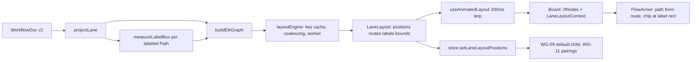

# Automation Pitch — Improvements

Improvements are a separate track after the sequential relay in `.docs/BUILD_PLAN.md`. Each improvement starts from the latest COMPLETE entry in `.docs/handoff.md`, follows the same relay protocol (`.cursor/rules/agent-handoff.mdc`), commits as `feat(improve-NN): <title>`, and saves evidence under `.docs/evidence/improve-NN-<slug>/`. Contract changes go under `## Amendments` in `.docs/GOAL.md`; clauses are never edited in place.

---

# Improvement 01 — ELK layout and bundled Path routing

Approved 2026-09-07. Sections 1–10 are the approved plan, saved verbatim.

## 1. Problem and outcome

Today [`tileMetrics.ts`](src/board/layout/tileMetrics.ts) (`dockPosition`, `clearDockPosition`, `vacantSpot`) only ever places new tiles right and down, nothing re-packs, and [`layoutLane.ts`](src/board/layout/layoutLane.ts) only widens x for chips. Paths are routed one at a time by Smart Edge with a native mid-point-bend fallback ([`polyline.ts`](src/board/routing/polyline.ts) `nativeStepPolyline`), so sibling Paths bend at different x and overlap as a comb; every labeled Path is also re-routed around its own chip because chips are fed back as provider-wide `avoidAreas` ([`Board.tsx`](src/board/Board.tsx) `onLabelRects`).

Outcome the user sees after this improvement:
- Every lane is laid out as compact left-to-right columns; siblings stack vertically in one column; 1:1 chains are straight lines; a fan-out parent is centered on its children.
- All Paths leaving a Node share one trunk and one vertical spine and split at right angles; Paths entering a Node merge the same way. No Path crosses a Node. No diagonal segments.
- Condition chips sit on their own branch segment; gutters widen to fit them and contract when they shorten (CX-05 behavior preserved).
- Layout is deterministic; adding a Node animates neighbors modestly (existing 200 ms motion); reduced motion snaps.
- Saved JSON and undo are unchanged (positions in the document stay creation hints).

## 2. Locked decisions (not re-opened during implementation)

- Engine: `elkjs@^0.12.0` (ELK 0.12, EPL-2.0), layered algorithm, `elk.direction: RIGHT`, `elk.edgeRouting: ORTHOGONAL`. Loaded via `elkjs/lib/elk-api.js` plus the worker script as a Vite `?url` asset so the main bundle does not grow; unit tests use `elkjs/lib/elk.bundled.js` on the main thread.
- One ELK pass per lane computes Node positions, Path routes, and chip positions together. `@tisoap/react-flow-smart-edge` is removed entirely (no second engine, no fallback router).
- Ports: every Node gets explicit `in` (WEST, x=0, y=h/2) and `out` (EAST, x=w, y=h/2) ports with `elk.portConstraints: FIXED_POS`, matching the React Flow handles at 50% height. All outgoing Paths use the same `out` port, which is what makes ELK route them as one hyperedge (shared trunk and spine).
- Chips: passed to ELK as inline center edge labels sized by the existing `measureLabelBox` (wrap/clamp rules in [`labelBox.ts`](src/board/layout/labelBox.ts) unchanged). `placeLabels.ts` and `PathLayout.tsx` are deleted.
- Layout stays derived (the CX-05 model) for both lanes; nothing is written to the document. Stability comes from `elk.layered.considerModelOrder.strategy: NODES_AND_EDGES` (document order), not from saved positions.
- Saved `position` fields remain in the schema and are still assigned on creation (no schema v3, no migration). They serve only as the pre-layout fallback and as the fallback for WG-09/WG-11 when no layout exists yet.
- Layout output is rounded to integer pixels and not snapped to the 32 px grid (snapping would desync bend points from handles). The dotted background stays cosmetic.
- Mixed strokes on a shared trunk: solid Paths render after dotted ones, so a trunk shared by an always-visited Path and choice Paths looks solid; each Path keeps its stroke past the split.
- `elk.layered.wrapping.strategy` stays `OFF` in shipped code. One evidence screenshot with `MULTI_EDGE` on the 30-object fixture is captured with a local, uncommitted constant change so the user can evaluate wrapping later.
- No frame/border UI is drawn in this improvement; `LaneLayout.bounds` is computed and exposed for a possible Improvement 02.

## 3. Contract and document edits

Append to `## Amendments` in [`.docs/GOAL.md`](.docs/GOAL.md) (clauses are never edited in place):

- `- 2026-09-07 — CX-03 — Path routing is computed by the Eclipse Layout Kernel (elkjs, layered algorithm, orthogonal edge routing) in the same pass as Node layout. Paths leaving one Node share one trunk and split at right angles; Paths entering one Node merge the same way; no Path crosses a Node. @tisoap/react-flow-smart-edge is retired. The orthogonal/stepped look and dotted strokes are unchanged. — approved by user`
- `- 2026-09-07 — CX-04 — Condition chips are placed by ELK as inline center edge labels sized from the wrapped and clamped chip box (LABEL_MAX_WIDTH, LABEL_MAX_LINES). The layout reserves gutter space for every chip, so chips never cover Nodes or each other. Chips remain independent hit targets (CX-02). — approved by user`
- `- 2026-09-07 — CX-05 — The derived lane layout computes every displayed Node position, Path route, and chip position from the lane projection with ELK. Saved Node positions remain in the document as creation hints only and stay excluded from save and undo semantics. Layout is deterministic for a given projection; shortening a condition contracts the lane. — approved by user`
- `- 2026-09-07 — WG-09, WG-11 — "First outgoing child" and "nearest visual pairings" are evaluated on the displayed (derived) positions of the active lane, falling back to saved positions when no layout exists yet. — approved by user`
- `- 2026-09-07 — PC-01, PC-03 — Where an always-visited (solid) Path shares a trunk with choice (dotted) Paths out of one Node, the trunk renders solid (solid Paths draw above dotted); each Path keeps its own stroke after the split. — approved by user`

Other doc edits (small, to prevent contradictions):
- [`.docs/BUILD_PLAN.md`](.docs/BUILD_PLAN.md) Section 3, directly after the "Do not add ELK/Dagre ..." paragraph, add: `> 2026-09-07: superseded for layout and Path routing by .docs/IMPROVEMENTS.md Improvement 01 — elkjs is approved; @tisoap/react-flow-smart-edge is retired.`
- [`.cursor/rules/agent-handoff.mdc`](.cursor/rules/agent-handoff.mdc): add `elkjs 0.12 (layout and Path routing, worker-loaded)` to the retained stack; change "COMPLETE commit recorded for the previous slice" to "previous slice or improvement"; add a bullet: "Improvements after the relay are specified in `.docs/IMPROVEMENTS.md`; same protocol; commits are `feat(improve-NN): <title>`; evidence under `.docs/evidence/improve-NN-<slug>/`."
- [`.docs/handoff.md`](.docs/handoff.md): append one entry titled `## Improvement 01 — ELK layout and bundled Path routing — <date>` using the existing template.

## 4. Architecture



Data contract (new file `src/board/layout/laneLayout.ts`):

```ts
import type { Point } from "../../workflow/types";
export type Rect = { x: number; y: number; w: number; h: number };
export type LaneLayout = {
  key: string;                       // laneGraphKey the layout was computed for
  positions: Record<string, Point>;  // node id -> top-left, integer px, absolute
  routes: Record<string, Point[]>;   // edge id -> [start, ...bends, end], absolute
  labels: Record<string, Rect>;      // edge id -> chip rect, absolute (labeled Paths only)
  bounds: Rect;                      // root box including padding
};
export type LayoutPhase = "initial" | "updating" | "ready";
```

## 5. ELK graph specification

Build in `src/board/layout/elkGraph.ts` from `LaneProjection` plus `Record<edgeId, LabelBox>`:

```ts
export const ROOT_OPTIONS: Record<string, string> = {
  "elk.algorithm": "layered",
  "elk.direction": "RIGHT",
  "elk.edgeRouting": "ORTHOGONAL",
  "elk.padding": "[top=32,left=32,bottom=32,right=32]",
  "elk.spacing.nodeNode": "32",                        // BRANCH_GAP within a column
  "elk.layered.spacing.nodeNodeBetweenLayers": "64",   // TILE_GAP minimum gutter
  "elk.layered.spacing.edgeNodeBetweenLayers": "32",
  "elk.layered.spacing.edgeEdgeBetweenLayers": "16",   // spine track pitch
  "elk.spacing.edgeNode": "16",
  "elk.spacing.edgeEdge": "16",
  "elk.spacing.edgeLabel": "8",
  "elk.edgeLabels.inline": "true",
  "elk.edgeLabels.placement": "CENTER",
  "elk.layered.layering.strategy": "NETWORK_SIMPLEX",
  "elk.layered.nodePlacement.strategy": "BRANDES_KOEPF",
  "elk.layered.crossingMinimization.strategy": "LAYER_SWEEP",
  "elk.layered.considerModelOrder.strategy": "NODES_AND_EDGES",
  "elk.layered.thoroughness": "10",
  "elk.layered.mergeEdges": "true",
  "elk.separateConnectedComponents": "false",
  "elk.layered.wrapping.strategy": "OFF",              // evidence-only run: MULTI_EDGE
  "elk.aspectRatio": "1.6",
};
```

Node, port, edge, label shapes:

```ts
// node
{ id, width: nodeSize(type).w, height: nodeSize(type).h,
  layoutOptions: { "elk.portConstraints": "FIXED_POS" },
  ports: [
    { id: `${id}__in`,  x: 0, y: h / 2, width: 0, height: 0, layoutOptions: { "elk.port.side": "WEST" } },
    { id: `${id}__out`, x: w, y: h / 2, width: 0, height: 0, layoutOptions: { "elk.port.side": "EAST" } },
  ] }
// edge
{ id, sources: [`${source}__out`], targets: [`${target}__in`],
  labels: box ? [{ id: `${id}__label`, text: label, width: box.w, height: box.h }] : undefined }
```

Rules for the agent:
- ELK ignores unknown option ids silently. A unit test must assert every option key used (root, node, port, label) appears in `elk.knownLayoutOptions()` after mapping `org.eclipse.elk.` to `elk.`.
- Model order is the projection's array order; do not sort nodes or edges before building the graph.
- Group tiles (`projectedKind: "group"`) and After-only extras are ordinary Step-sized nodes to the layout.
- Output mapping (`src/board/layout/elkLayout.ts`): node `x/y` are absolute for a flat root; edge `sections[0].startPoint/bendPoints/endPoint` and label `x/y` are relative to the root, hence absolute here. Round everything with `Math.round`. Assert one section per edge. Verify the frame of reference with the unit assertion "label center lies on its route within 1 px".
- Node placement tuning is the only agent judgment call: keep `BRANDES_KOEPF`; if the Oak Park evidence shows a fan-out parent not centered on its children within 16 px or the `e_enter_review` chain not straight, try `elk.layered.nodePlacement.strategy: NETWORK_SIMPLEX` with `elk.layered.nodePlacement.favorStraightEdges: true` and keep whichever satisfies (1) straight 1:1 chains, (2) centered fan-outs, (3) smaller total height. Record the choice in the handoff.

## 6. Implementation tasks (in order)

### T0 — Dependencies and documents
- `npm uninstall @tisoap/react-flow-smart-edge`; `npm install elkjs@^0.12.0`; lockfile updated; `npm audit` clean.
- Create `.docs/IMPROVEMENTS.md` (Sections 1–10 of this plan) and apply the Section 3 doc edits.

### T1 — Layout engine (framework-free, under `src/board/layout/`)
- `laneLayout.ts`: types from Section 4.
- `elkGraph.ts`: `buildElkGraph(projection, boxes): ElkNode` and `laneGraphKey(projection, boxes): string` (nodes as `id:type`, edges as `id:source>target:boxW x boxH`). Title, detail, and actor changes must not change the key.
- `elkLayout.ts`: `toLaneLayout(key, laidOut: ElkNode): LaneLayout` per the mapping rules; `emptyLayout(key)`.
- `layoutEngine.ts`: `createLayoutEngine(elk: { layout(g): Promise<ElkNode> }, { cacheSize = 32 })` returning `{ get(key): LaneLayout | undefined; request(lane, projection, boxes): Promise<LaneLayout> }`. Per-lane coalescing with a sequence number (stale resolutions dropped), 60 ms debounce (latest wins), empty projection resolves synchronously to `emptyLayout` without calling ELK, errors logged once and rejected so the caller keeps the previous layout.
- `elkClient.ts` (browser only; never imported by tests):

```ts
import ELK from "elkjs/lib/elk-api.js";
import workerUrl from "elkjs/lib/elk-worker.min.js?url";
export const elk = new ELK({ workerUrl });   // worker fetch starts at app start
export const layoutEngine = createLayoutEngine(elk);
```

- Confirm `elkjs/lib/elk-api.d.ts` types (`ElkNode`, `ElkExtendedEdge`, `ElkPort`, `ElkLabel`, `ElkEdgeSection`) compile under `tsc --noEmit`; `?url` typing comes from `vite/client`, already referenced in [`src/vite-env.d.ts`](src/vite-env.d.ts).

### T2 — Displayed positions for graph rules (`src/workflow/`, stays framework-free)
- Add `export type PositionMap = Record<string, Point>` to [`types.ts`](src/workflow/types.ts) and a `positionOf(nodes, id, positions?)` helper in [`graph.ts`](src/workflow/graph.ts).
- Thread an optional trailing `positions?: PositionMap` through `outgoingSorted`, `incomingSorted`, `removalCandidateIds`, `defaultRemovalCandidateId` ([`graph.ts`](src/workflow/graph.ts)) and `removalNeighborhood`, `pairingBetween`, `nearestPairings`, `planNodeRemoval` ([`commands.ts`](src/workflow/commands.ts) lines 249–295 and 494 onward). Existing callers and tests keep working because the parameter is optional.

### T3 — Store ([`src/state/store.ts`](src/state/store.ts))
- Add `laneLayoutPositions: Partial<Record<AssignmentLane, PositionMap>>` and `setLaneLayoutPositions(lane, positions)` (no-op when unchanged). Reset to `{}` wherever `canvasEpoch` is bumped (New/Demo/Import, around lines 323–333 and 954–964).
- Pass the active lane's map (`view === After ? after : before`) into `removalCandidateIds`, `defaultRemovalCandidateId`, `planNodeRemoval`, `nearestPairings` around lines 792–875. No other store behavior changes.

### T4 — Board integration ([`src/board/Board.tsx`](src/board/Board.tsx))
- New hook `src/board/layout/useLaneLayout.ts`: `useLaneLayout(lane, projection, boxes): { layout: LaneLayout | null; phase: LayoutPhase }`. A cache hit returns synchronously (no flash on view switches); otherwise the previous layout is kept with `phase: "updating"`, or `"initial"` when none exists. Publishes `layout.positions` to the store when `layout.key` changes.
- Replace [`useModestMotion.ts`](src/board/layout/useModestMotion.ts) with `useAnimatedLayout(layout): LaneLayout | null`: same 200 ms ease and 280 px modest threshold, but interpolates positions, routes (existing `lerpPolylines`), and label rect x/y together so Path endpoints stay glued to moving tiles. New ids appear at target and are excluded from the delta; removed ids drop; the first layout and reduced motion snap.
- Remove `SmartEdgeProvider`, `PathLayoutProvider`, `avoidAreas`, `onLabelRects`, `onMetrics`, `settled`, `obstacleNodes`, `nodeRects`, `layoutLane`. Keep `labelBoxes` (now ELK input) and the departing-ghost logic (`lastPos` reads animated positions).
- Provide a new `LaneLayoutContext` (`src/board/routing/LaneLayoutContext.ts`) carrying the animated layout around `<ReactFlow>`.
- Edge order: dotted first, solid last, selected edge moved to the end (draw order implements the stroke rule).
- Lane host attributes: `data-layout={phase}` replaces `data-smart-edge`; add `data-layout-error="true"` when the engine rejected. CSS in [`tokens.css`](src/app/styles/tokens.css): `.board-lane[data-layout="initial"] .react-flow__viewport { visibility: hidden; }`.
- Viewport: drop the `fitView` prop; on the first non-initial phase, if no stored `laneViewports[lane]`, call `rf.fitView({ padding: 0.28 })` once. The focus-centering effect reads animated positions.
- Remove-preview edges are not part of the layout; they render with the orthogonal fallback (T5).

### T5 — FlowArrow ([`src/board/routing/FlowArrow.tsx`](src/board/routing/FlowArrow.tsx))
- Remove `useSmartEdgePath`, `usePathLayout`, `placementCenter`, `nearestOnPolyline`, `nativeStepPolyline`, `pointsFromSmart`.
- Route source: `layout.routes[id]` from `LaneLayoutContext`; fallback `orthogonalPolyline(sourceX, sourceY, targetX, targetY)` for preview edges or missing routes. Keep the `useStretch` restitch animation (from the `via` polyline to the route) unchanged.
- Chip: `EdgeLabelRenderer` positioned at the `labels[id]` center with explicit `width`/`height` from the rect so the DOM box equals the reserved space; fallback to the route midpoint. Keep `wrapConditionLines`, `aria-label`, click-to-select, and `tabIndex` rules.
- Stroke: `strokeLinecap: "butt"`, `strokeLinejoin: "miter"`; dash `8 7` and widths unchanged.

### T6 — Removals and cleanup
- Delete `src/board/layout/layoutLane.ts` (and its test), `src/board/routing/placeLabels.ts` (and its test), `src/board/routing/PathLayout.tsx`, `src/board/routing/smartStep.ts`.
- In [`polyline.ts`](src/board/routing/polyline.ts) keep `orthogonalPolyline`, `polylineToSvg`, `pathLength`, `pointAtLength`, `resamplePolyline`, `lerpPolylines`, `polylineKey`; delete `nativeStepPolyline`, `parseSvgPath`, `pointsFromSmart`, `segmentsOf`, `alongSegment`, `nearestOnPolyline`, `rectsOverlap`, `pointRectDistance` if unreferenced (grep). Trim `polyline.test.ts` accordingly.
- In [`tileMetrics.ts`](src/board/layout/tileMetrics.ts) keep sizes, constants, and the dock/vacant helpers (saved hints); delete `labelChipWidth`/`gapForLabel` if unreferenced.
- Update the Smart Edge comment in [`src/workflow/catalogs.ts`](src/workflow/catalogs.ts); remove `.path-layout-host` CSS if present.

### T7 — Unit tests (Vitest, `elk.bundled.js` on the main thread)
New `src/board/layout/elkLayout.test.ts` using Oak Park (`oakParkInvoice()` + `projectBefore`), Robot Mailroom After (`projectAfter`), and a 15-Step/14-Path stress document:
- Every option key used is in `knownLayoutOptions()`.
- Positions are integers; no two node rects intersect.
- Each route starts at `(pos.x + w, pos.y + h/2)` of its source and ends at `(pos.x, pos.y + h/2)` of its target within 1 px; consecutive points share x or y (orthogonal).
- Fan-out `e_gt`/`e_lt`: identical first point and identical `points[1].x` (shared trunk and spine).
- Chain `e_enter_review`: constant y (straight); `e_acct_enter` likewise (apply the Section 5 tuning before weakening).
- Label rects for `e_gt`/`e_lt` intersect no node rect and not each other; each label center lies on its route within 1 px.
- Determinism: two runs deep-equal; a `structuredClone`d input deep-equals.
- Stability: adding a leaf keeps `web` above `fs`.
- `bounds` contains all node and label rects; an empty projection returns an empty layout without calling ELK (spy).
- Stress: 30 objects lay out under 1 s on the main thread in Node.
- `laneGraphKey` changes with label box size and edge endpoints, not with titles.

Other unit tests: `graph.test.ts` and `commands.test.ts` add cases where a `PositionMap` reorders siblings and `defaultRemovalCandidateId`/`nearestPairings` follow the map; `store.commands.test.ts` adds `setLaneLayoutPositions` then `beginRemovePick` selecting the displayed-topmost child; keep `store.layout.test.ts` (saved positions untouched on label edit); new `layoutEngine.test.ts` covers cache hit, coalescing (stale result dropped), debounce, empty projection, and rejection keeping the previous layout.

### T8 — E2E ([`e2e/ready.ts`](e2e/ready.ts), [`e2e/routing.spec.ts`](e2e/routing.spec.ts), every spec importing them)
- Rename `waitForRouting` to `waitForLayout`: all `[data-layout]` hosts must reach `ready`; drop the `data-labels-ready` loop; update every import.
- Keep the existing routing tests (chip beside tile, CX-05 contraction, CX-02 zoom, Before/After/Both, dark, restitch, stress under 8 s including the first worker load, 1024 width) with the new waiter and the evidence folder `.docs/evidence/improve-01-layout/`.
- Add: parse `d` of `path#e_gt` and `path#e_lt` (`BaseEdge` sets `id`): same first point, same second-point x, no diagonal segments. Add: `path#e_enter_review` has constant y. Add: after `+ Step` on `Review BS&A Software`, the new tile appears in the column right of Review and the lane returns to `ready` within 2 s.
- Playwright still runs against the Vite dev server; the worker is served from `/node_modules/...` there.

### T9 — Evidence, handoff, commit
- Screenshots (1440×900 unless noted) in `.docs/evidence/improve-01-layout/`: `before-light-1440` (bundled fan-out, straight chain), `condition-chip-1440`, `label-contract-1440`, `after-light-1440`, `both-light-1440`, `before-dark-1440`, `restitch-1440`, `stress-30-1440`, `add-step-1440`, `mailroom-after-1440`, `wrapping-multi-edge-1440` (local uncommitted `MULTI_EDGE` constant, documented as evidence-only), `before-light-1024` (1024×768).
- Handoff entry per template; commit `feat(improve-01): add ELK layout and bundled Path routing`; clean tree; report hash and results.

## 7. Verification checklist (exact)
- `npm run build` passes; `dist/assets/` contains an `elk-worker.min-*.js` asset and the main chunk no longer references `react-flow-smart-edge`.
- `npm run test:unit` and `npm run test:e2e` pass (report counts).
- `npx vite preview --port 4178 --strictPort`, load `/` once, confirm `.board-lane[data-layout="ready"]` in DevTools (production worker URL check); record in the handoff.
- Manual: type a long condition and clear it (gutter widens then contracts); remove `Write BS&A Software` (restitch stretches then settles); switch Before/After/Both (no flash, cache hit); Present mode Space toggle works.

## 8. Risks and fallbacks
- Inline label placement looks wrong (chip off its branch): first verify the coordinate frame with the unit assertion; if ELK's inline placement proves unsuitable, keep labels in the ELK graph for spacing but position chips at the midpoint of the longest horizontal segment of their own route (small helper in FlowArrow). Record in the handoff.
- Worker fails to construct (CSP, URL): `elkClient.ts` catches and falls back to `elk.bundled.js` on the main thread via dynamic import; `data-layout-error` is set only if both fail.
- Fan-out parent not centered or chain not straight: apply the Section 5 tuning; never hand-adjust coordinates.
- Performance: ELK on 30 objects is about 10–30 ms on the worker; the first load fetches about 1.6 MB once (browser-cached). The 8 s stress budget already covers it.
- React Flow `fitView` timing: nodes carry explicit `width`/`height`/`measured`, so `rf.fitView` after the first layout is reliable; if not, defer one animation frame.

## 9. Out of scope (follow-ups, not done here)
- Frame/border around the laid-out graph (SH-01 decision): candidate Improvement 02 using `LaneLayout.bounds`.
- Enabling `elk.layered.wrapping.strategy` by default: evaluate from the evidence screenshot.
- Laying out remove-preview pairings as a full preview layout.
- Junction dots at hyperedge splits (`elk.junctionPoints`).
- Any merge/After-only creation logic (Slice 11) or hardening (Slice 12).

## 10. Kickoff prompt for the implementing agent

```text
You are the agent for Improvement 01 of the Automation Pitch project. Work only on Improvement 01 as specified in .docs/IMPROVEMENTS.md.

Before changing anything:
1. Read .docs/GOAL.md (including Amendments), .docs/BUILD_PLAN.md Sections 3-4, .docs/IMPROVEMENTS.md, every entry in .docs/handoff.md, and .cursor/rules/agent-handoff.mdc.
2. Run `git status` and `git log -1`. HEAD must be the COMPLETE commit of the latest handoff entry and the tree must be clean. If not, stop and report.
3. Run `npm install`, `npm run build`, `npm run test:unit` to confirm a green start.

Then implement Improvement 01 exactly as specified (tasks T0-T9, tests in Section 7, verification in Section 7). Locked decisions in Section 2 are not open for redesign; the only judgment call is the node placement tuning in Section 5. If something in the spec is impossible or contradictory, stop and ask; do not widen scope.

When done: run `npm run build`, `npm run test:unit`, `npm run test:e2e`; save screenshots under .docs/evidence/improve-01-layout/; append one handoff entry ending in `Status: COMPLETE`; commit everything as `feat(improve-01): add ELK layout and bundled Path routing`; confirm a clean tree; report the hash, exact test results, and evidence paths. Never push, branch, or start other work.
```

---

# Improvement 02 — merge tile, stretchy +, Path-pull, insert (COMPLETE)

Shipped as `feat(improve-02): add merge tile type and tile drag`. Spec was [`.docs/merge-tile-and-drag.plan.md`](merge-tile-and-drag.plan.md) (Path `−` was dropped in favor of selected-tile X). Visual reference for the `+` tab: `.docs/menu-tab-plus.png` and `.docs/menu-tab-plus.svg`.

---

# Improvement 03 — polish, Path stroke, on-canvas label (COMPLETE)

Approved 2026-09-07. **Do not implement Improvements 04–07 in the same chat.**

Full spec: [`.docs/improve-03-polish-and-path.plan.md`](improve-03-polish-and-path.plan.md).

Commit: `feat(improve-03): polish chrome Path stroke and on-canvas label`.  
Evidence: `.docs/evidence/improve-03-polish/`.

### Kickoff prompt for the implementing agent

```text
You are the agent for Improvement 03 of the Automation Pitch project. Work only on Improvement 03 as specified in .docs/improve-03-polish-and-path.plan.md. Do not implement Improvements 04–07.

Before changing anything:
1. Read .docs/GOAL.md (including Amendments), .docs/BUILD_PLAN.md Sections 3-4, .docs/IMPROVEMENTS.md, .docs/improve-03-polish-and-path.plan.md, .docs/VISUAL_IMPROVEMENTS.md, every entry in .docs/handoff.md, and .cursor/rules/agent-handoff.mdc.
2. Run `git status` and `git log -1`. HEAD must be the COMPLETE commit of the latest handoff entry (`docs: add improve-06 shell and improve-07 no-merge plans`) and the tree must be clean. If not, stop and report.
3. Run `npm install`, `npm run build`, `npm run test:unit` to confirm a green start.

Then implement Improvement 03 exactly as specified in that plan (locked decisions, GOAL amendments, work items 5.1–5.9, tests). Locked decisions are not open for redesign. If something in the spec is impossible or contradictory, stop and ask; do not widen scope. Do not start Improvements 04–07.

When done: run `npm run build`, `npm run test:unit`, `npm run test:e2e`; save screenshots under .docs/evidence/improve-03-polish/; append one handoff entry ending in `Status: COMPLETE`; commit everything as `feat(improve-03): polish chrome Path stroke and on-canvas label`; confirm a clean tree; report the hash, exact test results, and evidence paths. Never push, branch, or start other work.
```

---

# Improvement 04 — insert-on-Path live preview (COMPLETE)

Approved 2026-09-07. Start only after Improvement 03 is COMPLETE.

Full spec: [`.docs/improve-04-insert-preview.plan.md`](improve-04-insert-preview.plan.md).

Commit: `feat(improve-04): preview tile insert on Path while dragging`.  
Evidence: `.docs/evidence/improve-04-insert-preview/`.

### Kickoff prompt for the implementing agent

```text
You are the agent for Improvement 04 of the Automation Pitch project. Work only on Improvement 04 as specified in .docs/improve-04-insert-preview.plan.md. Do not reopen Improvement 03 polish. Do not implement Improvements 05–07.

Before changing anything:
1. Read .docs/GOAL.md (including Amendments), .docs/BUILD_PLAN.md Sections 3-4, .docs/IMPROVEMENTS.md, .docs/improve-04-insert-preview.plan.md, .docs/VISUAL_IMPROVEMENTS.md, every entry in .docs/handoff.md, and .cursor/rules/agent-handoff.mdc.
2. Run `git status` and `git log -1`. HEAD must be the COMPLETE commit of Improvement 03 and the tree must be clean. If not, stop and report.
3. Run `npm install`, `npm run build`, `npm run test:unit` to confirm a green start.

Then implement Improvement 04 exactly as specified in that plan. Do not run ELK on pointer move. Do not call insertNodeOnPath until drop. Locked decisions are not open for redesign. If something in the spec is impossible or contradictory, stop and ask; do not widen scope.

When done: run `npm run build`, `npm run test:unit`, `npm run test:e2e`; save screenshots under .docs/evidence/improve-04-insert-preview/; append one handoff entry ending in `Status: COMPLETE`; commit everything as `feat(improve-04): preview tile insert on Path while dragging`; confirm a clean tree; report the hash, exact test results, and evidence paths. Never push, branch, or start other work.
```

---

# Improvement 05 — Step select stay-put, chunky view switch (COMPLETE)

Approved 2026-09-07. Start only after Improvement 04 is COMPLETE.

Full spec: [`.docs/improve-05-chrome.plan.md`](improve-05-chrome.plan.md). User picture: [view switch](visual-improvements/2026-09-07-view-switch-fill.png).

Commit: `feat(improve-05): keep Steps still and chunk the view switch`.  
Evidence: `.docs/evidence/improve-05-chrome/`.

### Kickoff prompt for the implementing agent

```text
You are the agent for Improvement 05 of the Automation Pitch project. Work only on Improvement 05 as specified in .docs/improve-05-chrome.plan.md. Do not reopen Improvements 03 or 04. Do not implement Improvements 06 or 07.

Before changing anything:
1. Read .docs/GOAL.md (including Amendments), .docs/BUILD_PLAN.md Sections 3-4, .docs/IMPROVEMENTS.md, .docs/improve-05-chrome.plan.md, .docs/VISUAL_IMPROVEMENTS.md, every entry in .docs/handoff.md, and .cursor/rules/agent-handoff.mdc.
2. Run `git status` and `git log -1`. HEAD must be the COMPLETE commit of Improvement 04 (`feat(improve-04): preview tile insert on Path while dragging`) and the tree must be clean. If not, stop and report.
3. Run `npm install`, `npm run build`, `npm run test:unit` to confirm a green start.

Then implement Improvement 05 exactly as specified in that plan. Remove the 1 px select translate on Step/merge tiles. Restyle only the Before/After/Both switch (chunky ink-or-cream frame, yellow fill to the outer radius, no cyan hairline). Do not restyle the rest of the chrome. Do not copy Nintendo or Aseprite pixels. Locked decisions are not open for redesign. If something in the spec is impossible or contradictory, stop and ask; do not widen scope.

When done: run `npm run build`, `npm run test:unit`, `npm run test:e2e`; save screenshots under .docs/evidence/improve-05-chrome/; append one handoff entry ending in `Status: COMPLETE`; commit everything as `feat(improve-05): keep Steps still and chunk the view switch`; confirm a clean tree; report the hash, exact test results, and evidence paths. Never push, branch, or start other work.
```

---

# Improvement 06 — inspector Who, trash, Other copy, zoom, hamburger (COMPLETE)

Approved 2026-09-07. Start only after Improvement 05 is COMPLETE. **Do not implement Improvement 07 in the same chat.**

Full spec: [`.docs/improve-06-shell.plan.md`](improve-06-shell.plan.md). Pictures: [Who](visual-improvements/2026-09-07-who-alice-selected.png), [zoom](visual-improvements/2026-09-07-wheel-zoom.gif).

Commit: `feat(improve-06): quiet Who select trash Other and finer zoom`.  
Evidence: `.docs/evidence/improve-06-shell/`.

### Kickoff prompt for the implementing agent

```text
You are the agent for Improvement 06 of the Automation Pitch project. Work only on Improvement 06 as specified in .docs/improve-06-shell.plan.md. Do not reopen Improvements 03–05. Do not implement Improvement 07 (merge removal).

Before changing anything:
1. Read .docs/GOAL.md (including Amendments), .docs/BUILD_PLAN.md Sections 3-4, .docs/IMPROVEMENTS.md, .docs/improve-06-shell.plan.md, .docs/VISUAL_IMPROVEMENTS.md, every entry in .docs/handoff.md, and .cursor/rules/agent-handoff.mdc.
2. Run `git status` and `git log -1`. HEAD must be the COMPLETE commit of Improvement 05 (`feat(improve-05): keep Steps still and chunk the view switch`) and the tree must be clean. If not, stop and report.
3. Run `npm install`, `npm run build`, `npm run test:unit` to confirm a green start.

Then implement Improvement 06 exactly as specified in that plan. Who/Type selected fill only (no dashed ring; cream fill in dark). Trash icon top-right of Step/Data inspector. Other tiles show Name only. Drop BEFORE/AFTER corner chips. Close the hamburger when the pointer returns to the canvas. Finer wheel zoom; zoom-in toward the laid-out graph when the pointer is on empty paper. Locked decisions are not open for redesign. If something in the spec is impossible or contradictory, stop and ask; do not widen scope.

When done: run `npm run build`, `npm run test:unit`, `npm run test:e2e`; save screenshots under .docs/evidence/improve-06-shell/; append one handoff entry ending in `Status: COMPLETE`; commit everything as `feat(improve-06): quiet Who select trash Other and finer zoom`; confirm a clean tree; report the hash, exact test results, and evidence paths. Never push, branch, or start other work.
```

---

# Improvement 07 — surgical merge removal (COMPLETE)

Approved 2026-09-07. Start only after Improvement 06 is COMPLETE.

Full spec: [`.docs/improve-07-no-merge.plan.md`](improve-07-no-merge.plan.md).

Commit: `feat(improve-07): remove merge groups from the product`.  
Evidence: `.docs/evidence/improve-07-no-merge/`.

### Kickoff prompt for the implementing agent

```text
You are the agent for Improvement 07 of the Automation Pitch project. Work only on Improvement 07 as specified in .docs/improve-07-no-merge.plan.md. Do not reopen Improvements 03–06. Do not redesign merge.

Before changing anything:
1. Read .docs/GOAL.md (including Amendments), .docs/BUILD_PLAN.md Sections 3-4, .docs/IMPROVEMENTS.md, .docs/improve-07-no-merge.plan.md, .docs/VISUAL_IMPROVEMENTS.md, every entry in .docs/handoff.md, and .cursor/rules/agent-handoff.mdc.
2. Run `git status` and `git log -1`. HEAD must be the COMPLETE commit of Improvement 06 (`feat(improve-06): quiet Who select trash Other and finer zoom`) and the tree must be clean. If not, stop and report.
3. Run `npm install`, `npm run build`, `npm run test:unit` to confirm a green start.

Then implement Improvement 07 exactly as specified in that plan. Surgical removal of merge UI and runtime. Keep after.groups in the schema; unfold on load; Mailroom has no group. Do not bump the document version. Do not remove After-only Steps. Locked decisions are not open for redesign. If something in the spec is impossible or contradictory, stop and ask; do not widen scope.

When done: run `npm run build`, `npm run test:unit`, `npm run test:e2e`; save screenshots under .docs/evidence/improve-07-no-merge/; append one handoff entry ending in `Status: COMPLETE`; commit everything as `feat(improve-07): remove merge groups from the product`; confirm a clean tree; report the hash, exact test results, and evidence paths. Never push, branch, or start other work.
```

---

# Improvement 08 — restore + taffy, tuck tabs, fix Path stroke (COMPLETE)

Approved 2026-09-07. Start only after Improvement 07 is COMPLETE. **Do not mix into Improvement 07.**

Full spec: [`.docs/improve-08-plus-chrome.plan.md`](improve-08-plus-chrome.plan.md). Pictures: [plus submenu](visual-improvements/2026-09-07-plus-submenu.gif), [tabs overlap](visual-improvements/2026-09-07-plus-tabs-overlap.png), liked taffy [plus-pull](visual-improvements/2026-09-07-plus-pull.gif), tab draft [menu-tab-plus](menu-tab-plus.png).

Commit: `feat(improve-08): restore plus taffy and fix Path stroke`.  
Evidence: `.docs/evidence/improve-08-plus-chrome/`.

Correction 2 (2026-09-08): pulled `+` taffy outline is a 3px `--line` band fully outside the green fill, matching tile borders.

### Kickoff prompt for the implementing agent

```text
You are the agent for Improvement 08 of the Automation Pitch project. Work only on Improvement 08 as specified in .docs/improve-08-plus-chrome.plan.md. Do not reopen Improvement 07. Do not reopen Improvements 03–06 except the defects named in that plan.

Before changing anything:
1. Read .docs/GOAL.md (including Amendments), .docs/BUILD_PLAN.md Sections 3-4, .docs/IMPROVEMENTS.md, .docs/improve-08-plus-chrome.plan.md, .docs/VISUAL_IMPROVEMENTS.md, every entry in .docs/handoff.md, and .cursor/rules/agent-handoff.mdc.
2. Run `git status` and `git log -1`. HEAD must be the COMPLETE commit of Improvement 07 (`feat(improve-07): remove merge groups from the product`) and the tree must be clean. If not, stop and report.
3. Run `npm install`, `npm run build`, `npm run test:unit` to confirm a green start.

Then implement Improvement 08 exactly as specified in that plan. Restore the green + taffy and keep the dim scrim; drop the wedge. Dismiss the fan immediately on empty release. Tuck + and Path tabs behind the tile. Spindle-and-string Path glyph. X hover is color-only. Data fan thumb matches Step. Path double-click and inspector Dotted/Solid must change the drawn stroke. Locked decisions are not open for redesign. If something in the spec is impossible or contradictory, stop and ask; do not widen scope.

When done: run `npm run build`, `npm run test:unit`, `npm run test:e2e`; save screenshots under .docs/evidence/improve-08-plus-chrome/; append one handoff entry ending in `Status: COMPLETE`; commit everything as `feat(improve-08): restore plus taffy and fix Path stroke`; confirm a clean tree; report the hash, exact test results, and evidence paths. Never push, branch, or start other work.
```

---

# Improvement 09 — tile chrome, Data root, After removal (COMPLETE)

Approved 2026-09-08. Start only after Improvement 08 is COMPLETE.

Full spec: [`.docs/improve-09-chrome-and-root.plan.md`](improve-09-chrome-and-root.plan.md). Pictures: [tabs and select](visual-improvements/2026-09-08-tile-tabs-select-x.png), [taffy hole](visual-improvements/2026-09-08-plus-taffy-hole.png).

Commit: `feat(improve-09): center tabs Data root and After remove`.  
Evidence: `.docs/evidence/improve-09-chrome-root/`.

---

# Improvement 10 — insert preview Paths and move cursor (COMPLETE)

Approved 2026-09-08. Start only after Improvement 09 is COMPLETE.

Full spec: [`.docs/improve-10-drag-preview.plan.md`](improve-10-drag-preview.plan.md). GIF: [drag preview Paths](visual-improvements/2026-09-08-drag-preview-paths.gif).

Commit: `feat(improve-10): clean insert preview and move cursor`.  
Evidence: `.docs/evidence/improve-10-drag-preview/`.

Correction 2 (2026-09-08): empty paper and `+` / Path tabs use a chunky ink+halo grab SVG (same recipe as move) instead of the blurry system grab bitmap.

Correction 3 (2026-09-08): drop the custom black SVG cursors. Tiles use the platform `move` cursor; pan and pull-tabs use platform `grab` / `grabbing`; the tile X stays `pointer`.

Correction 4 (2026-09-08): pan and pull-tabs use a white/black OS-style grab hand (same look as the pointer). Platform `grab` stays blurry on Windows because Chrome only ships a 1× bitmap.

Correction 5 (2026-09-08): unique segments of bundled sibling Paths are drop targets. Only incident Paths fade. Shared trunk / inbound merge still does not pick a Path.

---

# Improvement 11 — Path Delete menu and hit pad (COMPLETE)

Approved 2026-09-08. Start only after Improvement 10 is COMPLETE.

Full spec: [`.docs/improve-11-path-delete.plan.md`](improve-11-path-delete.plan.md). Picture: [path delete hit](visual-improvements/2026-09-08-path-delete-hit.png).

Commit: `feat(improve-11): delete redundant Paths from the context menu`.  
Evidence: `.docs/evidence/improve-11-path-delete/`.

Correction 1 (2026-09-08): selected-Path hint strip includes Right-click Delete with the other hotkeys.

---

# Improvement 12 — tile chrome on hover (COMPLETE)

Approved 2026-09-08. Start only after Improvement 11 correction 1 is COMPLETE.

GIF: [tile hover chrome](visual-improvements/2026-09-08-tile-hover-chrome.gif).

Commit: `feat(improve-12): show tile chrome on hover`.  
Evidence: `.docs/evidence/improve-12-hover-chrome/`.

X, `+`, and Path appear while an editable tile is **hovered or selected** (or that tile’s `+` / Path pull is in progress). Hover does not select; the inspector stays on the current selection. Present and Both still hide chrome. Pull and X still work from an unselected hover. No new dependency.

---

# Improvement 13 — inherit parent Who on child Step

Approved 2026-09-08. Start only after Improvement 11 correction 1 is COMPLETE. Do not mix into Improvement 12 hover chrome.

When a Before-origin Step is created from another Step (`+` / `1`), the child gets that parent’s Before actor on both lanes. Empty-board Add Step still defaults to last-used Human, else Alice, else the first Human. A child spawned from Data inherits the nearest upstream Step’s Who. After-only Steps stay the default Robot (BA-07).

Commit: `feat(improve-13): inherit parent actor on child Steps`.  
Evidence: `.docs/evidence/improve-13-who-inherit/`.

Correction 1 (2026-09-08): Data-parent spawn walks incoming Paths to the upstream Step so a Step created off Roy’s Data is also Roy.

---

# Improvement 16 — Other Task name and clipboard (COMPLETE)

Approved 2026-09-08. New Other Steps get Name **Task** so the tile shows copy. Choosing Type Other with an empty Name fills Task once; a typed Name is kept. The Other icon is a clipboard (generic work), a little larger than the other Type icons — not a circled exclamation. The tile still never prints the word Other.

Commit: `feat(improve-16): default Other Steps to Task`.  
Evidence: `.docs/evidence/improve-16-other-task/`.

---

# Improvement 15 — larger + and Path tabs

Approved 2026-09-08. Tile `+` (create Step / Data) and Path-pull tabs are **44×44** (were 36×36) and peek **24px** past the right edge (were 18px) so they are easier to click. Glyphs scale with the tab. The X stays the same size. No new dependency.

Commit: `feat(improve-15): enlarge tile plus and Path tabs`.  
Evidence: `.docs/evidence/improve-15-tab-size/`.

---

# Improvement 19 — closer Step/Data + fan

Approved 2026-09-08. The Step and Data boxes that appear when you pull tile `+` sit closer to the source tile. The extra 28px outward offset (from the old wedge) is gone, and the fan radius is 104px (was 118). Drop, After Step-only, keys `1` / `2`, taffy, and scrim are unchanged. No new dependency.

Commit: `feat(improve-19): pull Step Data fan closer`.  
Evidence: `.docs/evidence/improve-19-plus-fan/`.

---

# Improvement 17 — Read Type is an open book

Approved 2026-09-08. The Read task icon is an **open book** (blue covers, cream pages, ink spine) so it is distinct from Other’s clipboard. Stored Type `read` and the picker label Read are unchanged. No new dependency.

Commit: `feat(improve-17): use an open book for Read`.  
Evidence: `.docs/evidence/improve-17-read-book/`.

---

# Improvement 18 — Path zip vs Tile blip

Approved 2026-09-08. Tile create keeps the existing soft sine blip. Pulling a Path from the tile Path tab (or Connect existing) plays a distinct original **zip**: a short rising bandpass-noise sweep plus a taut-string triangle, same low-volume toy-synth family as the other cues (P-01, SH-04). No samples, no new dependency.

Commit: `feat(improve-18): zip Path create apart from Tile blip`.  
Evidence: `.docs/evidence/improve-18-path-zip/`.

---

# Improvement 20 — foldable right inspector

Approved 2026-09-08. The right inspector folds to a thin strip with a ‹ so the board can use the extra space. Click the strip (or Hide inspector when open, ›) to toggle. Present still hides the inspector and the strip. Preference persists. No new dependency.

Commit: `feat(improve-20): fold the right inspector`.  
Evidence: `.docs/evidence/improve-20-inspector-fold/`.

---

# Improvement 21 — bottom status bar

Approved 2026-09-08. A thin chrome status bar spans the bottom of the window and overlaps the right inspector. It shows the loaded project name (Untitled when unnamed), a persisted **right-click-delete: on/off** toggle, an **Actors** button that opens Manage actors, and **v** plus the version from `package.json` (set to 1.0.0). When the toggle is on, right-clicking a Tile removes it through the same path as X / Delete. Off by default. Present and Both hide Actors. No new dependency.

Commit: `feat(improve-21): add bottom status bar`.  
Evidence: `.docs/evidence/improve-21-status-bar/`.

---

# Improvement 22 — create tabs closer to the tile

Approved 2026-09-08. Tile `+` (create Step / Data) and Path-pull tabs stay 44×44 and on top of the right edge, but peek **14px** past it (were 24px) so they sit against the tile like the X. Glyphs, pull, hover, and Present/Both hide rules are unchanged. No new dependency.

Commit: `feat(improve-22): sit create tabs closer to the tile`.  
Evidence: `.docs/evidence/improve-22-tab-peek/`.

---

# Improvement 23 — on-canvas tile text and Type/Who pie

Approved 2026-09-08. Double-click a Step’s Name, Details, actor name, or Human role to edit that field on the tile (same values as the inspector; actor name/role edits the roster). Double-click the task icon for a Type pie wheel; double-click the actor figure for a Who pie; double-click Robot Type for LLM / Agent / Script. Inspector Who/Type remain. Present and Both stay read-only. No new dependency.

Commit: `feat(improve-23): edit tile text and icons on double-click`.  
Evidence: `.docs/evidence/improve-23-tile-edit/`.

---

# Improvement 24 — first Tile from New is centered

Approved 2026-09-08. Starting from New, Add Step or Add Data places the first Tile at the **center of the board** at the current zoom. Empty layouts no longer consume the one-time camera, so the Tile is not stuck in the top left. Demos still fitView on first load. No new dependency.

Commit: `feat(improve-24): center the first Tile from New`.  
Evidence: `.docs/evidence/improve-24-first-tile-center/`.

---

# Improvement 25 — coral Data mark

Approved 2026-09-08. The Data oval is **coral** (`#e8784a` light, `#f09468` dark) instead of teal. Teal sat in the icy paper / chrome-line family. Coral is unused (not yellow select, not actor pastels, not plus green, not minus red). The Path-pull tab stays teal. No new dependency.

Commit: `feat(improve-25): recolor the Data mark coral`.  
Evidence: `.docs/evidence/improve-25-data-mark/`.

---

# Improvement 26 — Compare view, no pan outline

Approved 2026-09-08. The stacked comparison switch is **Compare** (stored view stays `both`). The cyan pan-target outline that boxed only the focused Compare pane is removed; both panes share the camera with no extra frame. Picture: [compare outline](visual-improvements/2026-09-08-compare-blue-outline.png).

Commit: `feat(improve-26): compare view without pan outline`.  
Evidence: `.docs/evidence/improve-26-compare/`.

---

# Improvement 27 — purple Data mark

Approved 2026-09-08. The Data oval is **grape purple** (`#7b3fe0` light, `#b07dff` dark) instead of coral. Distinct from Missy’s pastel lavender Who (`#c89bf5`). Path-pull tab stays teal. No new dependency.

Commit: `feat(improve-27): recolor the Data mark purple`.  
Evidence: `.docs/evidence/improve-27-data-purple/`.

---

# Improvement 29 — Data plus-pull scrim matches Data radius

Approved 2026-09-08. The plus-pull dim scrim punched a Step-shaped hole (`rx="14"`) over every source tile. Data uses radius 32, so paper showed between the cream fill and the ink border while creating from Data. Overlay holes now use the live tile’s screen-scaled radius (`nodeRadius` + `scaleCornerRadius`). No new dependency.

Commit: `feat(improve-29): match Data radius in plus-pull scrim`.  
Evidence: `.docs/evidence/improve-29-data-scrim/`.

---

# Improvement 28 — Who select is ink, not yellow

Approved 2026-09-08. Picture: [manage actors yellow](visual-improvements/2026-09-08-manage-actors-yellow-highlight.gif).

Selected Who / Manage actors cards use a **cream fill and 4px ink border** (pressed: no chip shadow), not mustard yellow. The inspector chrome is dark in both themes; yellow wrapping a pastel figure is the clash. Type and fat buttons keep yellow. View switch and Right Click Delete stay yellow. No new dependency.

Commit: `feat(improve-28): restyle selected Who without yellow`.  
Evidence: `.docs/evidence/improve-28-who-select/`.

Correction 1 (2026-09-08): the yellow the user wanted gone is the **inspector fold › / ‹ hover**, not the actor cards. Hover is cream + ink. Evidence: `.docs/evidence/improve-28-fold-hover/`.

Correction 2 (2026-09-08): cream hover was too harsh and hard to see; the blue focus ring is gone. Hover is a steel lift (`#3f5f71` light, `#3b4a51` dark) with the ice chevron. Keyboard focus uses an ink inset, not a blue outline.

---

# Improvement 30 — Right Click Delete on the right

Approved 2026-09-08. Picture: [toggle on the left](visual-improvements/2026-09-08-right-click-delete-left.gif).

After the project name left the status bar, **Right Click Delete** sat on the far left with the version on the far right. The toggle now sits on the **right** of the bar, immediately left of `v` plus the package version. Copy, pressed/yellow on/off, and right-click Tile remove are unchanged. No new dependency.

Commit: `feat(improve-30): put Right Click Delete on the right`.  
Evidence: `.docs/evidence/improve-30-status-toggle-right/`.

---

# Improvement 31 — Present hides the nav bar

Approved 2026-09-08. Present already hid the inspector, tile chrome, and hints. It still showed the top bar and status bar. Present now hides those too so the board is full-bleed. Space still toggles Before/After. Escape exits Present (Keybinds lists it). Present stays the first hamburger item for entering. No new dependency.

Commit: `feat(improve-31): hide the nav bar in Present`.  
Evidence: `.docs/evidence/improve-31-present-nav/`.

---

# Improvement 32 — YAML import and export

Approved 2026-09-08. User request: load demos from a serialized file, add hamburger **Export**, prefer YAML, and add an agent rule so later document changes keep serialization valid.

## Locked decisions

- Interchange format is the existing v2 `WorkflowDoc` as YAML 1.2 via `yaml@^2.9` (YAML 1.2, so JSON files still import). No custom schema language.
- Demo documents live in `src/demos/*.yaml` and load through `parseDocument` (same path as Import). TypeScript keeps ID constants, `freshBoard`, and clone loaders only.
- Hamburger: Present, New, Import, **Export**, Actors, Keybinds, Light/Dark, Demo chooser. Export downloads YAML and does not replace the board.
- Save copy uses the same YAML download and filename slug (`Oak Park Invoice` → `oak-park-invoice.yaml`).
- Browser localStorage remains pretty JSON. Recovery copy stays the raw stored payload.
- No CLI exporter.
- Agent rule: `.cursor/rules/workflow-serialization.mdc` (`alwaysApply`).

## Contract

Append to `## Amendments` in `.docs/GOAL.md` (already recorded with this improvement): SH-05, SH-13, NG-07, SH-08 as dated 2026-09-08.

Commit: `feat(improve-32): import and export workflows as YAML`.  
Evidence: `.docs/evidence/improve-32-import-export/`.

---

# Improvement 33 — Compare greys Who and text fields

Approved 2026-09-08. Compare already greys Type and Split keys (`opacity: 0.55`). Who keys stayed full-color even though they are disabled. Name, Details, Data Label, and Path condition used `readOnly`, so they looked like live fields.

Who keys use that same disabled fade. Inspector text fields are `disabled` in Compare so they pick up the same fade. No new dependency.

Commit: `feat(improve-33): grey Compare Who and text fields`.  
Evidence: `.docs/evidence/improve-33-compare-readonly/`.

---

# Improvement 34 — Add Tiles and Paths to the left

Approved 2026-09-08. Selected Tiles grow in both directions. The left `+` and Path-pull tabs are a mirror of the right: left creates a predecessor (Path new → this); left Path-pull drop on X creates X → this. Fan-in is allowed. The nonempty board is a weakly connected DAG (no islands, no unique-root special cases). Spawn keys are Q/E Step and A/D Data. Pan keys default unbound. Keybinds live in localStorage only (Reset to defaults; no Arrow/WASD presets).

No new runtime dependency.

## Contract

Append to `## Amendments` in `.docs/GOAL.md`: WG-02, WG-03, WG-04, WG-05, WG-06, WG-07, NG-02, SH-09, SH-14, AQ-01, NA-03 as dated 2026-09-08.

Commit: `feat(improve-34): add Tiles and Paths to the left`.  
Evidence: `.docs/evidence/improve-34-reverse-add/`.

---

# Improvement 35 — default LLM, Script, Agent robots

Approved 2026-09-09. New boards ship three robots instead of one generic Robot/Script: **LLM / LLM**, **Script / Script**, **Agent / Agent**, in that order. LLM is the default Robot (first on the roster; After-only Steps). Name, Color, and Type stay independently editable. Oak Park’s Script actor is named Script (LLM was already LLM). Robot Mailroom is unchanged. Existing saved boards are not migrated.

No new runtime dependency.

## Contract

Append to `## Amendments` in `.docs/GOAL.md`: WG-01, NA-04 as dated 2026-09-09.

Commit: `feat(improve-35): default LLM Script and Agent robots`.  
Evidence: `.docs/evidence/improve-35-default-robots/`.

---

# Improvement 36 — keep branch rows when forking

Approved 2026-09-09. Left `+` / `Q` on a Tile that already has an incoming Path is a **fork** (fan-in): Path `new → this`, existing Paths stay. Right `+` / `E` is the same on the outgoing side. Drag-onto-Path still inserts; it does not fork.

Today ELK re-solves the whole lane (`NETWORK_SIMPLEX` + `LAYER_SWEEP`). A new predecessor is appended last in the model, so it sits at the bottom of the leftmost column. Crossing-minimization then lines the old top branch up with that new source and the other branch moves up. Same-row dock is skipped because `clearDockPosition` starts at port index 1 and walks down, and spawn uses saved creation hints instead of the displayed layout.

## Locked decisions

- Graph commands stay as they are: `+` on a side that already has a Path is a fork, not an insert. No new runtime dependency.
- First layout of a lane is unchanged (document order, `NETWORK_SIMPLEX`).
- After a derived layout exists, the next ELK pass orders Nodes and Paths by those displayed y values (new Tiles use their dock hint). `forceNodeModelOrder` and `LONGEST_PATH_SOURCE` keep that order so a short branch is not pulled into a new column.
- Spawn docks on the **same row** as the source, then walks further left/right if that slot overlaps; only then stacks down. Dock uses displayed positions, not stale document hints.
- Hints are not saved and are not undo entries.

## Contract

Append to `## Amendments` in `.docs/GOAL.md`: CX-05 as dated 2026-09-09.

Commit: `feat(improve-36): keep branch rows when forking`.  
Evidence: `.docs/evidence/improve-36-branch-rows/`.

---

# Improvement 37 — left spawn is a parent, not a fork

Approved 2026-09-09. Left `+` / `Q` / `A` always inserts a **new parent** of the selected Tile (e.g. Read → New → Roy), not a fan-in fork. The new Step inherits Who from that Tile (Roy when spawned off Roy). Forks stay **right-only** (`E` / right `+` / `D`). Drag-onto-Path and left Path-pull (connect existing) stay as they are.

## Locked decisions

- Before inbound `addConnectedNode`: retarget every Path into the host onto the new Tile, then add `new → this`. Incoming conditions and strokes stay on those Paths. With no incoming Path, Path `new → this` (new source).
- Right `+` still appends an outgoing Path (fork when the host already has children).
- Who: `whoForPredecessorStep` uses the same inherit-from-host walk as a child (`whoForChildStep`).
- After-only left `+` retargets After-only extra incoming Paths the same way. It does not rewrite Before Paths (an After-only parent of a Before-origin Tile cannot steal `Read → Roy`).
- Improvement 36 row-stability and same-row dock stay. No new runtime dependency.

## Contract

Append to `## Amendments` in `.docs/GOAL.md`: WG-07, NA-03, CX-05 as dated 2026-09-09.

Commit: `feat(improve-37): insert left spawn as parent`.  
Evidence: `.docs/evidence/improve-37-left-parent/`.

---

# Improvement 38 — tile chrome, hints, Type, Who, demo YAML

Approved 2026-09-09. Visual polish plus two product fixes from the same review.

## Locked decisions

- Tile `+` / Path tabs are **40×40** (were 44) and peek **18px** (were 14) so they sit slightly off the face without covering Path hits.
- The tile X is centered on the tile box (`left: 0; right: 0; margin: auto`), Step and Data.
- Right-click Delete hint follows the status-bar toggle. Path context-menu Delete is unchanged.
- Selected-tile hints are a two-line Q/E Step and A/D Data diagram with a left/right arrow.
- Data mark is a lighter grape (`#ae78f2` light, `#c9a6ff` dark).
- Type keypad keeps 3×3 including Other; names are not clipped. Selected Who is yellow like Type, with a matching yellow border (no ink outline).
- Manage actors opens on the selected Step’s Who.
- Demo YAML is re-read from disk in dev (Vite cache invalidation). Export fills a blank Human role as worker so a dropped fixture still parses.
- No new runtime dependency.

## Contract

Append to `## Amendments` in `.docs/GOAL.md`: P-06, WG-05, NA-06, NA-05, CX-07 as dated 2026-09-09.

Commit: `feat(improve-38): polish tile chrome hints and Type`.  
Evidence: `.docs/evidence/improve-38-chrome-hints/`.


---

# Improvement 40 — Humans then Robots on their own row

Approved 2026-09-09. Manage actors / Who listed actors in document order, so a new Human landed after the Robots and shared their row.

## Locked decisions

- Display: Humans first (document order among Humans), then Robots (document order among Robots). Robots always start on a new row, even when the last Human row has a gap. Slight extra space between the two groups.
- Add human inserts after the last Human. Add robot inserts after the last Robot (end of the roster on a new board).
- Same grouping in the Step inspector Who picker and Manage actors. No document version bump; existing mixed rosters are grouped on display only until the next add.
- No new runtime dependency.

## Contract

Append to `## Amendments` in `.docs/GOAL.md`: NA-05, NA-06 as dated 2026-09-09.

Commit: `feat(improve-40): group Humans then Robots on their own row`.  
Evidence: `.docs/evidence/improve-40-actor-groups/`.

---

# Improvement 39 — packed Type keypad, blank Other

Approved 2026-09-09. Inspector Type keys were oversized squares. Other’s clipboard showed writing lines and Name seeded “Task”.

## Locked decisions

- Type keypad stays 3×3 with Other last. Each key is packed (icon + name, minimal pad) so names are not clipped. The 3×3 cluster is centered in the inspector.
- Other Name is empty for new Steps and when switching Type to Other. A Name the user already typed is kept. The tile still never prints the word Other.
- Other icon is a blank clipboard (no writing lines) at the same keypad size as the other Types. Tile clipboard may stay a little larger.
- No new runtime dependency.

## Contract

Append to `## Amendments` in `.docs/GOAL.md`: NA-05, NA-10 as dated 2026-09-09.

Commit: `feat(improve-39): pack Type keypad and blank Other`.  
Evidence: `.docs/evidence/improve-39-type-compact/`.

---

# Improvement 41 — center Who keys in the inspector

Approved 2026-09-09. Who keys were left-aligned, so extra rail showed to the right of the last column.

## Locked decisions

- Who and Manage actors use the same cluster: `fit-content` width, `align-self: center` in the inspector stack, max 100% of the rail.
- Human/Robot row split is unchanged. Columns stay left-aligned inside the cluster so the first Human still sits above the first Robot.
- No new runtime dependency.

## Contract

Append to `## Amendments` in `.docs/GOAL.md`: NA-05, NA-06 as dated 2026-09-09.

Commit: `feat(improve-41): center Who keys in the inspector`.  
Evidence: `.docs/evidence/improve-41-who-center/`.

---

# Improvement 42 — hide Other on the Type keypad

Approved 2026-09-09. The inspector Type Other key still printed “Other” under the clipboard.

## Locked decisions

- Other is clipboard-only on the Type keypad. Accessible name stays `Type Other`.
- The name row is reserved (hidden, not removed) so icon size and spacing match Search / Write. The clipboard does not enlarge to fill the key.
- Tile copy is unchanged: Other still never prints the word Other; Name stays empty until typed.
- No new runtime dependency.

## Contract

Append to `## Amendments` in `.docs/GOAL.md`: NA-05, NA-10 as dated 2026-09-09.

Commit: `feat(improve-42): hide Other on the Type keypad`.  
Evidence: `.docs/evidence/improve-42-other-type-blank/`.

---

# Improvement 43 — chunky spawn hint compass

Approved 2026-09-09. Visual-only restyle of the selected-tile Q/E · A/D diagram.

## Locked decisions

- Keep the two-line Q/E Step and A/D Data map and the quiet keycaps.
- Replace the CAD shaft, CSS triangles, and `|` pipes with one inline SVG: **straight** chunky filled heads, a level round-cap shaft, and a vertical center tick. No bow, no tilted stroke.

- Same muted ink as the hint strip. After still shows Q/E only.
- No new runtime dependency.

## Contract

No GOAL amendment. P-01 / P-06 already cover the quiet chunky hint strip.

Commit: `feat(improve-43): restyle spawn hint compass`.  
Evidence: `.docs/evidence/improve-43-spawn-compass/`.

---

# Improvement 44 — Human default name and compact Name/Details

Approved 2026-09-09. Add human was `Person` plus a random number. Step inspector Name and Details each had a caption above the field.

## Locked decisions

- New Humans are named **Human** (no number). The name stays editable. Duplicate names are allowed; color distinguishes them.
- Step Name has no “Name” caption. The box shows the Type word on the left (Search, Read, …) and an underline for the title. Other has no prefix.
- Step Details has no “Details” caption: empty rounded box.
- Accessible names stay Name and Details. Manage actors Name uses the same compact box (no Type prefix).
- No new runtime dependency.

## Contract

Append to `## Amendments` in `.docs/GOAL.md`: NA-01, NA-07 as dated 2026-09-09.

Commit: `feat(improve-44): compact inspector Name and default Human`.  
Evidence: `.docs/evidence/improve-44-inspector-compact/`.

---

# Improvement 44 correction 1 — drop Step / Type / Who captions

Approved 2026-09-09. Step inspector still printed Step, Type, and Who above the keypad and actor keys.

## Locked decisions

- No visible Step, Type, or Who captions. The Type keypad and Who keys stay. Trash stays top-right.
- Accessible names remain Type (group), Who (group), and Remove Step.
- Data still shows a Data heading. Path is unchanged.
- No new runtime dependency.

## Contract

Append to `## Amendments` in `.docs/GOAL.md`: NA-07 as dated 2026-09-09.

Commit: `feat(improve-44): drop Step Type Who captions`.  
Evidence: `.docs/evidence/improve-44-inspector-labels/`.

---

# Improvement 45 — Delete a Tile selects its parent

Approved 2026-09-09. After removing a Tile, selection used to clear, so Delete could not walk a chain.

## Locked decisions

- A successful Tile remove (X / Delete / inspector trash / right-click Delete) selects the **parent**: the first remaining predecessor by displayed incoming order.
- Repeated Delete therefore peels a row from the leaf toward the source.
- Several parents (fan-in): the top incoming Tile wins.
- A source with remaining successors selects the first remaining successor so selection does not vanish on a leftover chain.
- Removing the last Tile still clears selection (empty board).
- Blocked removes keep the current Tile selected. After-only removes use the After graph. M:N confirm uses the same parent rule.
- Document and RF selection update in the same store set so the board cannot flash empty.
- No new runtime dependency.

## Contract

Append to `## Amendments` in `.docs/GOAL.md`: CX-07, AQ-03 as dated 2026-09-09.

Commit: `feat(improve-45): select parent after deleting a Tile`.  
Evidence: `.docs/evidence/improve-45-delete-parent/`.

---

# Improvement 46 — Scan, tall Other, clustered Name/Details

Approved 2026-09-09. The Type keypad was a 3×3 with Other as a ninth small key. Name/Details were full-rail underlined boxes, so they did not line up with Who.

## Locked decisions

- Scan is a first-class Type key (alphabetical). Drag, Approve, and File stay schema-only unless already stored.
- Other is a tall clipboard on the right of a 3×3, unlabeled, icon sized to the tall key.
- Type keypad, Name/Details well, and Who keys share one cluster width (four Who keys).
- Name/Details sit in a rounded sub-box. No underline. The Type prefix column is reserved for the longest Type word so the Name field does not change length.
- No new runtime dependency. Document version unchanged (Scan already existed in the schema).

## Contract

Append to `## Amendments` in `.docs/GOAL.md`: NA-05, NA-10, NA-07 as dated 2026-09-09.

Commit: `feat(improve-46): cluster Type Who and Scan`.  
Evidence: `.docs/evidence/improve-46-inspector-cluster/`.

---

# Improvement 47 — insert on merge and split trunks

Approved 2026-09-09. Option 1 from the insert-into-fork review. GIF: [insert into fork](visual-improvements/2026-09-09-insert-into-fork.gif).

## Locked decisions

- Unique Path segments stay single-Path insert (`insertNodeOnPath`).
- Hovering a shared merge or split trunk is a bundle drop. Merge: restitch T, retarget every incoming Path onto T, then Path `T → U`. Split: restitch T, Path `S → T`, then T inherits every outgoing Path from S.
- If the dragged Tile already sits on a bundled Path, the shared trunk stays a dead zone (Improvement 10). Unique sibling segments remain droppable.
- Preview is display-only. No ELK on pointer move. Drop commits, then one derived ELK pass.
- No new runtime dependency.

## Contract

Append to `## Amendments` in `.docs/GOAL.md`: NG-02, CX-05 as dated 2026-09-09.

Commit: `feat(improve-47): insert on merge and split trunks`.  
Evidence: `.docs/evidence/improve-47-insert-bundle/`.

---

# Improvement 48 — Present icon, menu left, Z remove, drop Dark and Actors

Approved 2026-09-09. User request with presenter.svg / presenter-edited.svg.

## Locked decisions

- Default Remove Node key is **Z** (Delete still removes; Ctrl+Z stays Undo). Saved maps that already bound Remove Node keep that bind.
- Hamburger drops **Present**, **Actors**, and **Light/Dark**. Remaining items: New, Import, Export, Keybinds, Demo chooser.
- Hamburger is the **leftmost** top-bar control (then Undo, sound).
- **Present** is a top-right icon: Streamline presenter (CC BY 4.0) as a white figure standing in front of a light-blue rounded rect so the figure fill covers the box stroke. No Tabler icon for this control.
- Present behavior is unchanged (full-bleed board; Space toggles; Escape exits). Manage actors stays in the inspector. Dark tokens remain for tests.
- No new runtime dependency.

## Contract

Append to `## Amendments` in `.docs/GOAL.md`: P-05, P-07, P-08, P-09, P-10, NA-06, SH-05, SH-14, WG-08 as dated 2026-09-09.

Commit: `feat(improve-48): present icon menu left and Z remove`.  
Evidence: `.docs/evidence/improve-48-chrome/`.

---

# Improvement 49 — hide the tile-drag hint strip

Approved 2026-09-09. User request with drag GIF: no Drop keycap, no Esc Cancel, no copy at all while dragging a Tile.

## Locked decisions

- `tile-drag` returns no chips and no spawn compass, so the helper unmounts. Selected-tile Q/E A/D hints come back when the drag ends.
- Drop still inserts on a Path or bundle. Escape still cancels (CX-08). Empty-canvas drop still cancels.
- Do not fall through to the selected-Node hints during the drag.
- No new runtime dependency.

## Contract

Append to `## Amendments` in `.docs/GOAL.md`: P-06 as dated 2026-09-09.

Commit: `feat(improve-49): hide the tile-drag hint strip`.  
Evidence: `.docs/evidence/improve-49-drag-hint/`.

---

# Improvement 50 — Type chip on the right, unclip Name caret

Approved 2026-09-09. User request with caret GIF and Search alignment screenshot.

## Locked decisions

- Name stays left-aligned in its cream box. Details stays an empty cream box.
- Type sits to the **right** of Name, in a cream chip (border + `--chip-shadow`) so it lifts off the dark well. Other and Details leave the reserved column empty (no empty chip).
- Reserved column is still sized to the longest Type word (`Approve`) so switching Type does not change Name length.
- Name caret is fully visible: taller line-height, padding, `overflow: visible` on the input and box.
- No new runtime dependency.

## Contract

Append to `## Amendments` in `.docs/GOAL.md`: NA-07 as dated 2026-09-09 (Type chip on the right; caret unclipped).

Commit: `feat(improve-50): lift Type chip and unclip Name caret`.  
Evidence: `.docs/evidence/improve-50-type-chip/`.

## Correction 1 — 2026-09-09

Type stays on the **left** of Name (not after the Name box). Chip fill is `--blue` with ice text, not cream. The chip is always the Approve-width column so clicking through Types does not move Name or Details. The Type word is right-aligned in that chip.

Commit: `feat(improve-50): blue Type chip on the left`.

---

# Improvement 51 — Present expand panes

Approved 2026-09-09. User request: Present should look like Compare, with a fullscreen control on each Before/After pane.

## Locked decisions

- Present opens as a stacked Before (top) / After (bottom) board, still full-bleed (no inspector, NodeToolbars, hints, top bar, or status bar) and still read-only.
- Each pane has a Tabler expand icon (`IconArrowsMaximize`) at its top-right. Clicking it fills the window with that lane and tucks the other. The icon becomes collapse (`IconArrowsMinimize`). Collapse returns to split.
- Space expands Before, then toggles Before/After. Escape returns to split when expanded, then exits Present.
- Compare (the edit-mode switch) is unchanged and has no expand controls.
- Present panes share pan/zoom like Compare (BA-05). Both Boards stay mounted so cameras persist.
- No new runtime dependency.

## Contract

Append to `## Amendments` in `.docs/GOAL.md`: P-07, BA-05, AQ-01, AQ-02 as dated 2026-09-09.

Commit: `feat(improve-51): expand Present Before After panes`.  
Evidence: `.docs/evidence/improve-51-present-expand/`.

---

# Improvement 52 — Actors up top and Manage polish

Approved 2026-09-09. Who moves above Type. Manage actors is a header stickman+Actors control. The actor editor matches the Step form: compact color, single-line Role, icon add, minus delete-mode. Robots drop the Type picker and gain Role.

## Locked decisions

- Step inspector order: Who, then Type / Name / Details.
- Header Actors control (HumanFigure + “Actors”, ~2× trash width) on every editable inspector. Toggle; no Back heading. Hidden in Compare and Present.
- Add is Human/Robot icons with a plus. Minus toggles delete mode (click actor deletes; unused-only NA-02; Escape exits delete mode first).
- Color is a compact cream chip plus Tabler eyedropper that opens a 14-swatch wheel. Role is one-line InspectorField.
- Robots store Role; hidden robotKind remains. No document version bump. Missing role fills from the Type word.
- New-board presets: Robot / LLM, Robot / Script, Robot / Agent. Add robot and auto-create: Robot / Script.
- Robot Who keys show Role. Tile second chip uses Role. Robot Type pie is gone.
- No new runtime dependency.

## Contract

Append to `## Amendments` in `.docs/GOAL.md`: NA-01, NA-04, NA-05, NA-06, NA-08, WG-01 as dated 2026-09-09.

Commit: `feat(improve-52): polish Actors header and Manage panel`.  
Evidence: `.docs/evidence/improve-52-actors/`.

---

# Improvement 53 — Actors back under Who, Manage restyle

Approved 2026-09-09 (correction of Improvement 52 chrome). Who returns to the bottom of the Step inspector. The Actors control is a Who-key under the roster, bottom right. Manage add/delete and Color match the Type keypad language.

## Locked decisions

- Step inspector order: Type / Name / Details, then Who, then Actors (right-aligned under Who). Trash stays top-right.
- Actors is the same Who-key chrome (HumanFigure in a paper well + “Actors”). Yellow when Manage is open. Hidden in Compare and Present.
- Manage ops row is four Who-keys: Add human, Add robot, trash delete-mode, Actors. Add keys use the same figures as the roster with a green plus badge and no name.
- Delete mode: trash key toggles; actor cards get a red border and X; click deletes (unused-only NA-02); Escape exits delete mode first.
- Color is a 36px cream swatch that opens the 14-swatch wheel, plus a separate eyedropper (EyeDropper API; falls back to the wheel). Role stays one-line in the same Name/Details well.
- Correction 1 (2026-09-09): Name over Role on the left; one tall card on the right (color fill / eyedropper). No outer well.
- No new runtime dependency.

## Contract

Append to `## Amendments` in `.docs/GOAL.md`: NA-05, NA-06 as dated 2026-09-09.

Commit: `feat(improve-53): restyle Actors under Who`.  
Evidence: `.docs/evidence/improve-53-actors-chrome/`.

