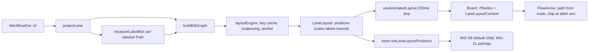

# Automation Pitch — Improvements

Improvements are a separate track after the sequential relay in `.docs/BUILD_PLAN.md`. Each improvement starts from the latest COMPLETE entry in `.docs/handoff.md`, follows the same relay protocol (`.cursor/rules/agent-handoff.mdc`), commits as `feat(improve-NN): <title>`, and saves evidence under `.docs/evidence/improve-NN-<slug>/`. Contract changes go under `## Amendments` in `.docs/GOAL.md`; clauses are never edited in place.

---

# Improvement 01 — ELK layout and bundled Path routing

Approved 2026-09-07. Sections 1–10 are the approved plan, saved verbatim.

## 1. Problem and outcome

Today [`tileMetrics.ts`](src/board/layout/tileMetrics.ts) (`dockPosition`, `clearDockPosition`, `vacantSpot`) only ever places new tiles right and down, nothing re-packs, and [`layoutLane.ts`](src/board/layout/layoutLane.ts) only widens x for chips. Paths are routed one at a time by Smart Edge with a native mid-point-bend fallback ([`polyline.ts`](src/board/routing/polyline.ts) `nativeStepPolyline`), so sibling Paths bend at different x and overlap as a comb; every labeled Path is also re-routed around its own chip because chips are fed back as provider-wide `avoidAreas` ([`Board.tsx`](src/board/Board.tsx) `onLabelRects`).

Outcome the user sees after this improvement:
- Every lane is laid out as compact left-to-right columns; siblings stack vertically in one column; 1:1 chains are straight lines; a fan-out parent is centered on its children.
- All Paths leaving a Node share one trunk and one vertical spine and split at right angles; Paths entering a Node merge the same way. No Path crosses a Node. No diagonal segments.
- Condition chips sit on their own branch segment; gutters widen to fit them and contract when they shorten (CX-05 behavior preserved).
- Layout is deterministic; adding a Node animates neighbors modestly (existing 200 ms motion); reduced motion snaps.
- Saved JSON and undo are unchanged (positions in the document stay creation hints).

## 2. Locked decisions (not re-opened during implementation)

- Engine: `elkjs@^0.12.0` (ELK 0.12, EPL-2.0), layered algorithm, `elk.direction: RIGHT`, `elk.edgeRouting: ORTHOGONAL`. Loaded via `elkjs/lib/elk-api.js` plus the worker script as a Vite `?url` asset so the main bundle does not grow; unit tests use `elkjs/lib/elk.bundled.js` on the main thread.
- One ELK pass per lane computes Node positions, Path routes, and chip positions together. `@tisoap/react-flow-smart-edge` is removed entirely (no second engine, no fallback router).
- Ports: every Node gets explicit `in` (WEST, x=0, y=h/2) and `out` (EAST, x=w, y=h/2) ports with `elk.portConstraints: FIXED_POS`, matching the React Flow handles at 50% height. All outgoing Paths use the same `out` port, which is what makes ELK route them as one hyperedge (shared trunk and spine).
- Chips: passed to ELK as inline center edge labels sized by the existing `measureLabelBox` (wrap/clamp rules in [`labelBox.ts`](src/board/layout/labelBox.ts) unchanged). `placeLabels.ts` and `PathLayout.tsx` are deleted.
- Layout stays derived (the CX-05 model) for both lanes; nothing is written to the document. Stability comes from `elk.layered.considerModelOrder.strategy: NODES_AND_EDGES` (document order), not from saved positions.
- Saved `position` fields remain in the schema and are still assigned on creation (no schema v3, no migration). They serve only as the pre-layout fallback and as the fallback for WG-09/WG-11 when no layout exists yet.
- Layout output is rounded to integer pixels and not snapped to the 32 px grid (snapping would desync bend points from handles). The dotted background stays cosmetic.
- Mixed strokes on a shared trunk: solid Paths render after dotted ones, so a trunk shared by an always-visited Path and choice Paths looks solid; each Path keeps its stroke past the split.
- `elk.layered.wrapping.strategy` stays `OFF` in shipped code. One evidence screenshot with `MULTI_EDGE` on the 30-object fixture is captured with a local, uncommitted constant change so the user can evaluate wrapping later.
- No frame/border UI is drawn in this improvement; `LaneLayout.bounds` is computed and exposed for a possible Improvement 02.

## 3. Contract and document edits

Append to `## Amendments` in [`.docs/GOAL.md`](.docs/GOAL.md) (clauses are never edited in place):

- `- 2026-09-07 — CX-03 — Path routing is computed by the Eclipse Layout Kernel (elkjs, layered algorithm, orthogonal edge routing) in the same pass as Node layout. Paths leaving one Node share one trunk and split at right angles; Paths entering one Node merge the same way; no Path crosses a Node. @tisoap/react-flow-smart-edge is retired. The orthogonal/stepped look and dotted strokes are unchanged. — approved by user`
- `- 2026-09-07 — CX-04 — Condition chips are placed by ELK as inline center edge labels sized from the wrapped and clamped chip box (LABEL_MAX_WIDTH, LABEL_MAX_LINES). The layout reserves gutter space for every chip, so chips never cover Nodes or each other. Chips remain independent hit targets (CX-02). — approved by user`
- `- 2026-09-07 — CX-05 — The derived lane layout computes every displayed Node position, Path route, and chip position from the lane projection with ELK. Saved Node positions remain in the document as creation hints only and stay excluded from save and undo semantics. Layout is deterministic for a given projection; shortening a condition contracts the lane. — approved by user`
- `- 2026-09-07 — WG-09, WG-11 — "First outgoing child" and "nearest visual pairings" are evaluated on the displayed (derived) positions of the active lane, falling back to saved positions when no layout exists yet. — approved by user`
- `- 2026-09-07 — PC-01, PC-03 — Where an always-visited (solid) Path shares a trunk with choice (dotted) Paths out of one Node, the trunk renders solid (solid Paths draw above dotted); each Path keeps its own stroke after the split. — approved by user`

Other doc edits (small, to prevent contradictions):
- [`.docs/BUILD_PLAN.md`](.docs/BUILD_PLAN.md) Section 3, directly after the "Do not add ELK/Dagre ..." paragraph, add: `> 2026-09-07: superseded for layout and Path routing by .docs/IMPROVEMENTS.md Improvement 01 — elkjs is approved; @tisoap/react-flow-smart-edge is retired.`
- [`.cursor/rules/agent-handoff.mdc`](.cursor/rules/agent-handoff.mdc): add `elkjs 0.12 (layout and Path routing, worker-loaded)` to the retained stack; change "COMPLETE commit recorded for the previous slice" to "previous slice or improvement"; add a bullet: "Improvements after the relay are specified in `.docs/IMPROVEMENTS.md`; same protocol; commits are `feat(improve-NN): <title>`; evidence under `.docs/evidence/improve-NN-<slug>/`."
- [`.docs/handoff.md`](.docs/handoff.md): append one entry titled `## Improvement 01 — ELK layout and bundled Path routing — <date>` using the existing template.

## 4. Architecture



Data contract (new file `src/board/layout/laneLayout.ts`):

```ts
import type { Point } from "../../workflow/types";
export type Rect = { x: number; y: number; w: number; h: number };
export type LaneLayout = {
  key: string;                       // laneGraphKey the layout was computed for
  positions: Record<string, Point>;  // node id -> top-left, integer px, absolute
  routes: Record<string, Point[]>;   // edge id -> [start, ...bends, end], absolute
  labels: Record<string, Rect>;      // edge id -> chip rect, absolute (labeled Paths only)
  bounds: Rect;                      // root box including padding
};
export type LayoutPhase = "initial" | "updating" | "ready";
```

## 5. ELK graph specification

Build in `src/board/layout/elkGraph.ts` from `LaneProjection` plus `Record<edgeId, LabelBox>`:

```ts
export const ROOT_OPTIONS: Record<string, string> = {
  "elk.algorithm": "layered",
  "elk.direction": "RIGHT",
  "elk.edgeRouting": "ORTHOGONAL",
  "elk.padding": "[top=32,left=32,bottom=32,right=32]",
  "elk.spacing.nodeNode": "32",                        // BRANCH_GAP within a column
  "elk.layered.spacing.nodeNodeBetweenLayers": "64",   // TILE_GAP minimum gutter
  "elk.layered.spacing.edgeNodeBetweenLayers": "32",
  "elk.layered.spacing.edgeEdgeBetweenLayers": "16",   // spine track pitch
  "elk.spacing.edgeNode": "16",
  "elk.spacing.edgeEdge": "16",
  "elk.spacing.edgeLabel": "8",
  "elk.edgeLabels.inline": "true",
  "elk.edgeLabels.placement": "CENTER",
  "elk.layered.layering.strategy": "NETWORK_SIMPLEX",
  "elk.layered.nodePlacement.strategy": "BRANDES_KOEPF",
  "elk.layered.crossingMinimization.strategy": "LAYER_SWEEP",
  "elk.layered.considerModelOrder.strategy": "NODES_AND_EDGES",
  "elk.layered.thoroughness": "10",
  "elk.layered.mergeEdges": "true",
  "elk.separateConnectedComponents": "false",
  "elk.layered.wrapping.strategy": "OFF",              // evidence-only run: MULTI_EDGE
  "elk.aspectRatio": "1.6",
};
```

Node, port, edge, label shapes:

```ts
// node
{ id, width: nodeSize(type).w, height: nodeSize(type).h,
  layoutOptions: { "elk.portConstraints": "FIXED_POS" },
  ports: [
    { id: `${id}__in`,  x: 0, y: h / 2, width: 0, height: 0, layoutOptions: { "elk.port.side": "WEST" } },
    { id: `${id}__out`, x: w, y: h / 2, width: 0, height: 0, layoutOptions: { "elk.port.side": "EAST" } },
  ] }
// edge
{ id, sources: [`${source}__out`], targets: [`${target}__in`],
  labels: box ? [{ id: `${id}__label`, text: label, width: box.w, height: box.h }] : undefined }
```

Rules for the agent:
- ELK ignores unknown option ids silently. A unit test must assert every option key used (root, node, port, label) appears in `elk.knownLayoutOptions()` after mapping `org.eclipse.elk.` to `elk.`.
- Model order is the projection's array order; do not sort nodes or edges before building the graph.
- Group tiles (`projectedKind: "group"`) and After-only extras are ordinary Step-sized nodes to the layout.
- Output mapping (`src/board/layout/elkLayout.ts`): node `x/y` are absolute for a flat root; edge `sections[0].startPoint/bendPoints/endPoint` and label `x/y` are relative to the root, hence absolute here. Round everything with `Math.round`. Assert one section per edge. Verify the frame of reference with the unit assertion "label center lies on its route within 1 px".
- Node placement tuning is the only agent judgment call: keep `BRANDES_KOEPF`; if the Oak Park evidence shows a fan-out parent not centered on its children within 16 px or the `e_enter_review` chain not straight, try `elk.layered.nodePlacement.strategy: NETWORK_SIMPLEX` with `elk.layered.nodePlacement.favorStraightEdges: true` and keep whichever satisfies (1) straight 1:1 chains, (2) centered fan-outs, (3) smaller total height. Record the choice in the handoff.

## 6. Implementation tasks (in order)

### T0 — Dependencies and documents
- `npm uninstall @tisoap/react-flow-smart-edge`; `npm install elkjs@^0.12.0`; lockfile updated; `npm audit` clean.
- Create `.docs/IMPROVEMENTS.md` (Sections 1–10 of this plan) and apply the Section 3 doc edits.

### T1 — Layout engine (framework-free, under `src/board/layout/`)
- `laneLayout.ts`: types from Section 4.
- `elkGraph.ts`: `buildElkGraph(projection, boxes): ElkNode` and `laneGraphKey(projection, boxes): string` (nodes as `id:type`, edges as `id:source>target:boxW x boxH`). Title, detail, and actor changes must not change the key.
- `elkLayout.ts`: `toLaneLayout(key, laidOut: ElkNode): LaneLayout` per the mapping rules; `emptyLayout(key)`.
- `layoutEngine.ts`: `createLayoutEngine(elk: { layout(g): Promise<ElkNode> }, { cacheSize = 32 })` returning `{ get(key): LaneLayout | undefined; request(lane, projection, boxes): Promise<LaneLayout> }`. Per-lane coalescing with a sequence number (stale resolutions dropped), 60 ms debounce (latest wins), empty projection resolves synchronously to `emptyLayout` without calling ELK, errors logged once and rejected so the caller keeps the previous layout.
- `elkClient.ts` (browser only; never imported by tests):

```ts
import ELK from "elkjs/lib/elk-api.js";
import workerUrl from "elkjs/lib/elk-worker.min.js?url";
export const elk = new ELK({ workerUrl });   // worker fetch starts at app start
export const layoutEngine = createLayoutEngine(elk);
```

- Confirm `elkjs/lib/elk-api.d.ts` types (`ElkNode`, `ElkExtendedEdge`, `ElkPort`, `ElkLabel`, `ElkEdgeSection`) compile under `tsc --noEmit`; `?url` typing comes from `vite/client`, already referenced in [`src/vite-env.d.ts`](src/vite-env.d.ts).

### T2 — Displayed positions for graph rules (`src/workflow/`, stays framework-free)
- Add `export type PositionMap = Record<string, Point>` to [`types.ts`](src/workflow/types.ts) and a `positionOf(nodes, id, positions?)` helper in [`graph.ts`](src/workflow/graph.ts).
- Thread an optional trailing `positions?: PositionMap` through `outgoingSorted`, `incomingSorted`, `removalCandidateIds`, `defaultRemovalCandidateId` ([`graph.ts`](src/workflow/graph.ts)) and `removalNeighborhood`, `pairingBetween`, `nearestPairings`, `planNodeRemoval` ([`commands.ts`](src/workflow/commands.ts) lines 249–295 and 494 onward). Existing callers and tests keep working because the parameter is optional.

### T3 — Store ([`src/state/store.ts`](src/state/store.ts))
- Add `laneLayoutPositions: Partial<Record<AssignmentLane, PositionMap>>` and `setLaneLayoutPositions(lane, positions)` (no-op when unchanged). Reset to `{}` wherever `canvasEpoch` is bumped (New/Demo/Import, around lines 323–333 and 954–964).
- Pass the active lane's map (`view === After ? after : before`) into `removalCandidateIds`, `defaultRemovalCandidateId`, `planNodeRemoval`, `nearestPairings` around lines 792–875. No other store behavior changes.

### T4 — Board integration ([`src/board/Board.tsx`](src/board/Board.tsx))
- New hook `src/board/layout/useLaneLayout.ts`: `useLaneLayout(lane, projection, boxes): { layout: LaneLayout | null; phase: LayoutPhase }`. A cache hit returns synchronously (no flash on view switches); otherwise the previous layout is kept with `phase: "updating"`, or `"initial"` when none exists. Publishes `layout.positions` to the store when `layout.key` changes.
- Replace [`useModestMotion.ts`](src/board/layout/useModestMotion.ts) with `useAnimatedLayout(layout): LaneLayout | null`: same 200 ms ease and 280 px modest threshold, but interpolates positions, routes (existing `lerpPolylines`), and label rect x/y together so Path endpoints stay glued to moving tiles. New ids appear at target and are excluded from the delta; removed ids drop; the first layout and reduced motion snap.
- Remove `SmartEdgeProvider`, `PathLayoutProvider`, `avoidAreas`, `onLabelRects`, `onMetrics`, `settled`, `obstacleNodes`, `nodeRects`, `layoutLane`. Keep `labelBoxes` (now ELK input) and the departing-ghost logic (`lastPos` reads animated positions).
- Provide a new `LaneLayoutContext` (`src/board/routing/LaneLayoutContext.ts`) carrying the animated layout around `<ReactFlow>`.
- Edge order: dotted first, solid last, selected edge moved to the end (draw order implements the stroke rule).
- Lane host attributes: `data-layout={phase}` replaces `data-smart-edge`; add `data-layout-error="true"` when the engine rejected. CSS in [`tokens.css`](src/app/styles/tokens.css): `.board-lane[data-layout="initial"] .react-flow__viewport { visibility: hidden; }`.
- Viewport: drop the `fitView` prop; on the first non-initial phase, if no stored `laneViewports[lane]`, call `rf.fitView({ padding: 0.28 })` once. The focus-centering effect reads animated positions.
- Remove-preview edges are not part of the layout; they render with the orthogonal fallback (T5).

### T5 — FlowArrow ([`src/board/routing/FlowArrow.tsx`](src/board/routing/FlowArrow.tsx))
- Remove `useSmartEdgePath`, `usePathLayout`, `placementCenter`, `nearestOnPolyline`, `nativeStepPolyline`, `pointsFromSmart`.
- Route source: `layout.routes[id]` from `LaneLayoutContext`; fallback `orthogonalPolyline(sourceX, sourceY, targetX, targetY)` for preview edges or missing routes. Keep the `useStretch` restitch animation (from the `via` polyline to the route) unchanged.
- Chip: `EdgeLabelRenderer` positioned at the `labels[id]` center with explicit `width`/`height` from the rect so the DOM box equals the reserved space; fallback to the route midpoint. Keep `wrapConditionLines`, `aria-label`, click-to-select, and `tabIndex` rules.
- Stroke: `strokeLinecap: "butt"`, `strokeLinejoin: "miter"`; dash `8 7` and widths unchanged.

### T6 — Removals and cleanup
- Delete `src/board/layout/layoutLane.ts` (and its test), `src/board/routing/placeLabels.ts` (and its test), `src/board/routing/PathLayout.tsx`, `src/board/routing/smartStep.ts`.
- In [`polyline.ts`](src/board/routing/polyline.ts) keep `orthogonalPolyline`, `polylineToSvg`, `pathLength`, `pointAtLength`, `resamplePolyline`, `lerpPolylines`, `polylineKey`; delete `nativeStepPolyline`, `parseSvgPath`, `pointsFromSmart`, `segmentsOf`, `alongSegment`, `nearestOnPolyline`, `rectsOverlap`, `pointRectDistance` if unreferenced (grep). Trim `polyline.test.ts` accordingly.
- In [`tileMetrics.ts`](src/board/layout/tileMetrics.ts) keep sizes, constants, and the dock/vacant helpers (saved hints); delete `labelChipWidth`/`gapForLabel` if unreferenced.
- Update the Smart Edge comment in [`src/workflow/catalogs.ts`](src/workflow/catalogs.ts); remove `.path-layout-host` CSS if present.

### T7 — Unit tests (Vitest, `elk.bundled.js` on the main thread)
New `src/board/layout/elkLayout.test.ts` using Oak Park (`oakParkInvoice()` + `projectBefore`), Robot Mailroom After (`projectAfter`), and a 15-Step/14-Path stress document:
- Every option key used is in `knownLayoutOptions()`.
- Positions are integers; no two node rects intersect.
- Each route starts at `(pos.x + w, pos.y + h/2)` of its source and ends at `(pos.x, pos.y + h/2)` of its target within 1 px; consecutive points share x or y (orthogonal).
- Fan-out `e_gt`/`e_lt`: identical first point and identical `points[1].x` (shared trunk and spine).
- Chain `e_enter_review`: constant y (straight); `e_acct_enter` likewise (apply the Section 5 tuning before weakening).
- Label rects for `e_gt`/`e_lt` intersect no node rect and not each other; each label center lies on its route within 1 px.
- Determinism: two runs deep-equal; a `structuredClone`d input deep-equals.
- Stability: adding a leaf keeps `web` above `fs`.
- `bounds` contains all node and label rects; an empty projection returns an empty layout without calling ELK (spy).
- Stress: 30 objects lay out under 1 s on the main thread in Node.
- `laneGraphKey` changes with label box size and edge endpoints, not with titles.

Other unit tests: `graph.test.ts` and `commands.test.ts` add cases where a `PositionMap` reorders siblings and `defaultRemovalCandidateId`/`nearestPairings` follow the map; `store.commands.test.ts` adds `setLaneLayoutPositions` then `beginRemovePick` selecting the displayed-topmost child; keep `store.layout.test.ts` (saved positions untouched on label edit); new `layoutEngine.test.ts` covers cache hit, coalescing (stale result dropped), debounce, empty projection, and rejection keeping the previous layout.

### T8 — E2E ([`e2e/ready.ts`](e2e/ready.ts), [`e2e/routing.spec.ts`](e2e/routing.spec.ts), every spec importing them)
- Rename `waitForRouting` to `waitForLayout`: all `[data-layout]` hosts must reach `ready`; drop the `data-labels-ready` loop; update every import.
- Keep the existing routing tests (chip beside tile, CX-05 contraction, CX-02 zoom, Before/After/Both, dark, restitch, stress under 8 s including the first worker load, 1024 width) with the new waiter and the evidence folder `.docs/evidence/improve-01-layout/`.
- Add: parse `d` of `path#e_gt` and `path#e_lt` (`BaseEdge` sets `id`): same first point, same second-point x, no diagonal segments. Add: `path#e_enter_review` has constant y. Add: after `+ Step` on `Review BS&A Software`, the new tile appears in the column right of Review and the lane returns to `ready` within 2 s.
- Playwright still runs against the Vite dev server; the worker is served from `/node_modules/...` there.

### T9 — Evidence, handoff, commit
- Screenshots (1440×900 unless noted) in `.docs/evidence/improve-01-layout/`: `before-light-1440` (bundled fan-out, straight chain), `condition-chip-1440`, `label-contract-1440`, `after-light-1440`, `both-light-1440`, `before-dark-1440`, `restitch-1440`, `stress-30-1440`, `add-step-1440`, `mailroom-after-1440`, `wrapping-multi-edge-1440` (local uncommitted `MULTI_EDGE` constant, documented as evidence-only), `before-light-1024` (1024×768).
- Handoff entry per template; commit `feat(improve-01): add ELK layout and bundled Path routing`; clean tree; report hash and results.

## 7. Verification checklist (exact)
- `npm run build` passes; `dist/assets/` contains an `elk-worker.min-*.js` asset and the main chunk no longer references `react-flow-smart-edge`.
- `npm run test:unit` and `npm run test:e2e` pass (report counts).
- `npx vite preview --port 4178 --strictPort`, load `/` once, confirm `.board-lane[data-layout="ready"]` in DevTools (production worker URL check); record in the handoff.
- Manual: type a long condition and clear it (gutter widens then contracts); remove `Write BS&A Software` (restitch stretches then settles); switch Before/After/Both (no flash, cache hit); Present mode Space toggle works.

## 8. Risks and fallbacks
- Inline label placement looks wrong (chip off its branch): first verify the coordinate frame with the unit assertion; if ELK's inline placement proves unsuitable, keep labels in the ELK graph for spacing but position chips at the midpoint of the longest horizontal segment of their own route (small helper in FlowArrow). Record in the handoff.
- Worker fails to construct (CSP, URL): `elkClient.ts` catches and falls back to `elk.bundled.js` on the main thread via dynamic import; `data-layout-error` is set only if both fail.
- Fan-out parent not centered or chain not straight: apply the Section 5 tuning; never hand-adjust coordinates.
- Performance: ELK on 30 objects is about 10–30 ms on the worker; the first load fetches about 1.6 MB once (browser-cached). The 8 s stress budget already covers it.
- React Flow `fitView` timing: nodes carry explicit `width`/`height`/`measured`, so `rf.fitView` after the first layout is reliable; if not, defer one animation frame.

## 9. Out of scope (follow-ups, not done here)
- Frame/border around the laid-out graph (SH-01 decision): candidate Improvement 02 using `LaneLayout.bounds`.
- Enabling `elk.layered.wrapping.strategy` by default: evaluate from the evidence screenshot.
- Laying out remove-preview pairings as a full preview layout.
- Junction dots at hyperedge splits (`elk.junctionPoints`).
- Any merge/After-only creation logic (Slice 11) or hardening (Slice 12).

## 10. Kickoff prompt for the implementing agent

```text
You are the agent for Improvement 01 of the Automation Pitch project. Work only on Improvement 01 as specified in .docs/IMPROVEMENTS.md.

Before changing anything:
1. Read .docs/GOAL.md (including Amendments), .docs/BUILD_PLAN.md Sections 3-4, .docs/IMPROVEMENTS.md, every entry in .docs/handoff.md, and .cursor/rules/agent-handoff.mdc.
2. Run `git status` and `git log -1`. HEAD must be the COMPLETE commit of the latest handoff entry and the tree must be clean. If not, stop and report.
3. Run `npm install`, `npm run build`, `npm run test:unit` to confirm a green start.

Then implement Improvement 01 exactly as specified (tasks T0-T9, tests in Section 7, verification in Section 7). Locked decisions in Section 2 are not open for redesign; the only judgment call is the node placement tuning in Section 5. If something in the spec is impossible or contradictory, stop and ask; do not widen scope.

When done: run `npm run build`, `npm run test:unit`, `npm run test:e2e`; save screenshots under .docs/evidence/improve-01-layout/; append one handoff entry ending in `Status: COMPLETE`; commit everything as `feat(improve-01): add ELK layout and bundled Path routing`; confirm a clean tree; report the hash, exact test results, and evidence paths. Never push, branch, or start other work.
```

---

# Improvement 02 — merge tile, stretchy +, Path-pull, insert (COMPLETE)

Shipped as `feat(improve-02): add merge tile type and tile drag`. Spec was [`.docs/merge-tile-and-drag.plan.md`](merge-tile-and-drag.plan.md) (Path `−` was dropped in favor of selected-tile X). Visual reference for the `+` tab: `.docs/menu-tab-plus.png` and `.docs/menu-tab-plus.svg`.

---

# Improvement 03 — polish, Path stroke, on-canvas label (COMPLETE)

Approved 2026-09-07. **Do not implement Improvements 04–07 in the same chat.**

Full spec: [`.docs/improve-03-polish-and-path.plan.md`](improve-03-polish-and-path.plan.md).

Commit: `feat(improve-03): polish chrome Path stroke and on-canvas label`.  
Evidence: `.docs/evidence/improve-03-polish/`.

### Kickoff prompt for the implementing agent

```text
You are the agent for Improvement 03 of the Automation Pitch project. Work only on Improvement 03 as specified in .docs/improve-03-polish-and-path.plan.md. Do not implement Improvements 04–07.

Before changing anything:
1. Read .docs/GOAL.md (including Amendments), .docs/BUILD_PLAN.md Sections 3-4, .docs/IMPROVEMENTS.md, .docs/improve-03-polish-and-path.plan.md, .docs/VISUAL_IMPROVEMENTS.md, every entry in .docs/handoff.md, and .cursor/rules/agent-handoff.mdc.
2. Run `git status` and `git log -1`. HEAD must be the COMPLETE commit of the latest handoff entry (`docs: add improve-06 shell and improve-07 no-merge plans`) and the tree must be clean. If not, stop and report.
3. Run `npm install`, `npm run build`, `npm run test:unit` to confirm a green start.

Then implement Improvement 03 exactly as specified in that plan (locked decisions, GOAL amendments, work items 5.1–5.9, tests). Locked decisions are not open for redesign. If something in the spec is impossible or contradictory, stop and ask; do not widen scope. Do not start Improvements 04–07.

When done: run `npm run build`, `npm run test:unit`, `npm run test:e2e`; save screenshots under .docs/evidence/improve-03-polish/; append one handoff entry ending in `Status: COMPLETE`; commit everything as `feat(improve-03): polish chrome Path stroke and on-canvas label`; confirm a clean tree; report the hash, exact test results, and evidence paths. Never push, branch, or start other work.
```

---

# Improvement 04 — insert-on-Path live preview (COMPLETE)

Approved 2026-09-07. Start only after Improvement 03 is COMPLETE.

Full spec: [`.docs/improve-04-insert-preview.plan.md`](improve-04-insert-preview.plan.md).

Commit: `feat(improve-04): preview tile insert on Path while dragging`.  
Evidence: `.docs/evidence/improve-04-insert-preview/`.

### Kickoff prompt for the implementing agent

```text
You are the agent for Improvement 04 of the Automation Pitch project. Work only on Improvement 04 as specified in .docs/improve-04-insert-preview.plan.md. Do not reopen Improvement 03 polish. Do not implement Improvements 05–07.

Before changing anything:
1. Read .docs/GOAL.md (including Amendments), .docs/BUILD_PLAN.md Sections 3-4, .docs/IMPROVEMENTS.md, .docs/improve-04-insert-preview.plan.md, .docs/VISUAL_IMPROVEMENTS.md, every entry in .docs/handoff.md, and .cursor/rules/agent-handoff.mdc.
2. Run `git status` and `git log -1`. HEAD must be the COMPLETE commit of Improvement 03 and the tree must be clean. If not, stop and report.
3. Run `npm install`, `npm run build`, `npm run test:unit` to confirm a green start.

Then implement Improvement 04 exactly as specified in that plan. Do not run ELK on pointer move. Do not call insertNodeOnPath until drop. Locked decisions are not open for redesign. If something in the spec is impossible or contradictory, stop and ask; do not widen scope.

When done: run `npm run build`, `npm run test:unit`, `npm run test:e2e`; save screenshots under .docs/evidence/improve-04-insert-preview/; append one handoff entry ending in `Status: COMPLETE`; commit everything as `feat(improve-04): preview tile insert on Path while dragging`; confirm a clean tree; report the hash, exact test results, and evidence paths. Never push, branch, or start other work.
```

---

# Improvement 05 — Step select stay-put, chunky view switch (COMPLETE)

Approved 2026-09-07. Start only after Improvement 04 is COMPLETE.

Full spec: [`.docs/improve-05-chrome.plan.md`](improve-05-chrome.plan.md). User picture: [view switch](visual-improvements/2026-09-07-view-switch-fill.png).

Commit: `feat(improve-05): keep Steps still and chunk the view switch`.  
Evidence: `.docs/evidence/improve-05-chrome/`.

### Kickoff prompt for the implementing agent

```text
You are the agent for Improvement 05 of the Automation Pitch project. Work only on Improvement 05 as specified in .docs/improve-05-chrome.plan.md. Do not reopen Improvements 03 or 04. Do not implement Improvements 06 or 07.

Before changing anything:
1. Read .docs/GOAL.md (including Amendments), .docs/BUILD_PLAN.md Sections 3-4, .docs/IMPROVEMENTS.md, .docs/improve-05-chrome.plan.md, .docs/VISUAL_IMPROVEMENTS.md, every entry in .docs/handoff.md, and .cursor/rules/agent-handoff.mdc.
2. Run `git status` and `git log -1`. HEAD must be the COMPLETE commit of Improvement 04 (`feat(improve-04): preview tile insert on Path while dragging`) and the tree must be clean. If not, stop and report.
3. Run `npm install`, `npm run build`, `npm run test:unit` to confirm a green start.

Then implement Improvement 05 exactly as specified in that plan. Remove the 1 px select translate on Step/merge tiles. Restyle only the Before/After/Both switch (chunky ink-or-cream frame, yellow fill to the outer radius, no cyan hairline). Do not restyle the rest of the chrome. Do not copy Nintendo or Aseprite pixels. Locked decisions are not open for redesign. If something in the spec is impossible or contradictory, stop and ask; do not widen scope.

When done: run `npm run build`, `npm run test:unit`, `npm run test:e2e`; save screenshots under .docs/evidence/improve-05-chrome/; append one handoff entry ending in `Status: COMPLETE`; commit everything as `feat(improve-05): keep Steps still and chunk the view switch`; confirm a clean tree; report the hash, exact test results, and evidence paths. Never push, branch, or start other work.
```

---

# Improvement 06 — inspector Who, trash, Other copy, zoom, hamburger

Approved 2026-09-07. Start only after Improvement 05 is COMPLETE. **Do not implement Improvement 07 in the same chat.**

Full spec: [`.docs/improve-06-shell.plan.md`](improve-06-shell.plan.md). Pictures: [Who](visual-improvements/2026-09-07-who-alice-selected.png), [zoom](visual-improvements/2026-09-07-wheel-zoom.gif).

Commit: `feat(improve-06): quiet Who select trash Other and finer zoom`.  
Evidence: `.docs/evidence/improve-06-shell/`.

### Kickoff prompt for the implementing agent

```text
You are the agent for Improvement 06 of the Automation Pitch project. Work only on Improvement 06 as specified in .docs/improve-06-shell.plan.md. Do not reopen Improvements 03–05. Do not implement Improvement 07 (merge removal).

Before changing anything:
1. Read .docs/GOAL.md (including Amendments), .docs/BUILD_PLAN.md Sections 3-4, .docs/IMPROVEMENTS.md, .docs/improve-06-shell.plan.md, .docs/VISUAL_IMPROVEMENTS.md, every entry in .docs/handoff.md, and .cursor/rules/agent-handoff.mdc.
2. Run `git status` and `git log -1`. HEAD must be the COMPLETE commit of Improvement 05 (`feat(improve-05): keep Steps still and chunk the view switch`) and the tree must be clean. If not, stop and report.
3. Run `npm install`, `npm run build`, `npm run test:unit` to confirm a green start.

Then implement Improvement 06 exactly as specified in that plan. Who/Type selected fill only (no dashed ring; cream fill in dark). Trash icon top-right of Step/Data inspector. Other tiles show Name only. Drop BEFORE/AFTER corner chips. Close the hamburger when the pointer returns to the canvas. Finer wheel zoom; zoom-in toward the laid-out graph when the pointer is on empty paper. Locked decisions are not open for redesign. If something in the spec is impossible or contradictory, stop and ask; do not widen scope.

When done: run `npm run build`, `npm run test:unit`, `npm run test:e2e`; save screenshots under .docs/evidence/improve-06-shell/; append one handoff entry ending in `Status: COMPLETE`; commit everything as `feat(improve-06): quiet Who select trash Other and finer zoom`; confirm a clean tree; report the hash, exact test results, and evidence paths. Never push, branch, or start other work.
```

---

# Improvement 07 — surgical merge removal

Approved 2026-09-07. Start only after Improvement 06 is COMPLETE.

Full spec: [`.docs/improve-07-no-merge.plan.md`](improve-07-no-merge.plan.md).

Commit: `feat(improve-07): remove merge groups from the product`.  
Evidence: `.docs/evidence/improve-07-no-merge/`.

### Kickoff prompt for the implementing agent

```text
You are the agent for Improvement 07 of the Automation Pitch project. Work only on Improvement 07 as specified in .docs/improve-07-no-merge.plan.md. Do not reopen Improvements 03–06. Do not redesign merge.

Before changing anything:
1. Read .docs/GOAL.md (including Amendments), .docs/BUILD_PLAN.md Sections 3-4, .docs/IMPROVEMENTS.md, .docs/improve-07-no-merge.plan.md, .docs/VISUAL_IMPROVEMENTS.md, every entry in .docs/handoff.md, and .cursor/rules/agent-handoff.mdc.
2. Run `git status` and `git log -1`. HEAD must be the COMPLETE commit of Improvement 06 (`feat(improve-06): quiet Who select trash Other and finer zoom`) and the tree must be clean. If not, stop and report.
3. Run `npm install`, `npm run build`, `npm run test:unit` to confirm a green start.

Then implement Improvement 07 exactly as specified in that plan. Surgical removal of merge UI and runtime. Keep after.groups in the schema; unfold on load; Mailroom has no group. Do not bump the document version. Do not remove After-only Steps. Locked decisions are not open for redesign. If something in the spec is impossible or contradictory, stop and ask; do not widen scope.

When done: run `npm run build`, `npm run test:unit`, `npm run test:e2e`; save screenshots under .docs/evidence/improve-07-no-merge/; append one handoff entry ending in `Status: COMPLETE`; commit everything as `feat(improve-07): remove merge groups from the product`; confirm a clean tree; report the hash, exact test results, and evidence paths. Never push, branch, or start other work.
```

