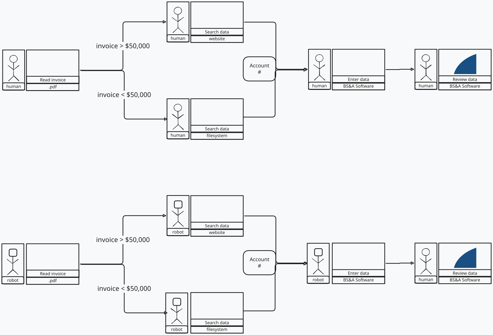

# AI Design Notes

I had some idea of a starting point for the visual design, so I used Excalidraw to draft out some basic boxes and a workflow of what the visuals could look like.




I've done this before a couple years ago and was pleased with the results. I still pleased with the results. I think it is much easier to describe certain UI/UX concepts this way because verbally describing the feel and look of something can be very difficult whether the listener is human or AI.


I used Claude Fable 5 & 5.1 and sent a very long prompt about what I wanted this software to do. I had it create a build plan. Then I had it reviewed by 2 other LLMs (Sol and Grok). Part of the build plan was to design it in such a way that it would be completed piece-wise by different agents (but not in parallel since there's too many things that would overlap each other and dependencies on existing features). When each agent was done with its piece, it was to take some screenshots with playwright, append the HANDOFF file and then I would start a new agent to continue where it left off. This continued across 12 agents. I used Grok for execution of these tasks.


The end result wasn't as impressive as the first few prompts that got me a baseline app, and a good chunk of time was spent taking notes of things that could use improvements: titles/labels for things that didn't make sense. Extra text that needed to go, menu layout and icon adjustments.


#### Building the Novel Features


Trying to design fairly novel and custom ways of interacting with the UX was difficult. I wanted to take inspiration from games like Dorfenwhatever, Aseprite (a sprite-making software) and of course my favorite, Excalidraw.


The intention was to have this in a Docker container so it could be run with a docker pull & docker run command. This was something I left alone until the design was more finalized, however.


## intention

While automating the workflow at my husbands work wouldn't be an ideal target, if for no other reason than it would replace a lot of work of his current role and potentially start the poison of AI fever in the office, as a worst case scenario,
I did want to use it as a real-life proof of concept.

Ideas for Future

While designing this I thought it could be interesting to see if the workflow steps could be exported in JSON or some format.

Then a UI could be built around these formats to attempt to generate some code/project scaffolding (likely also in Typescript/React)
that would offer some stubbed out interfaces and common utilities for common tasks.

However, keeping this UI app in-sync with backend consumers would likely be a headache.

Instead, I think it could be worthwhile to look at some code gen tools that can help create templates from workflows
(some visual workflow? mermaid diagrams?) and generate.

I'm not sure if this is the right approach, but in general, if one were to have multiple clients with different automation solutions,
having some uniformity across them could be a lot easier to maintain and ensure consistent quality.
If templates/automation software solutions fall within some common pattern, you could also reuse testing infrastrcture,
particularly for more complex tests like end-to-end or integration tests.

This could be particularly compelling if the automation solution were to offer a UI to the end-user (I'm guessing it probably should)
to control where to point the automation, stop/starting it, etc. If the UI could be agnostic to much of the automation details,
this UI could be consistent across domains and clients looking for basic automation of your typical office/admin work in small to medium sized businesses.


#### Scratchpad (to clean & rm later)

# Automation Pitch

A consulting board for showing office work **before** (people) and **after** (robots), with the same tiles and Paths.

```bash

npm install

npm run dev

```

Open the URL Vite prints. The Oak Park invoice demo loads first. Use + on a tile to add a Step or Data path, or link an existing tile. Toggle Before / After / Compare. New starts an empty board. Save copy from the New / Demo / Import prompt downloads the current board as JSON.

---


## Real Life Example Scenario

Vendor A wins a bid for an Oak Park government contract to do the work of outdoor holiday decorating for the end of the year.

Months later, after the work is performed, Vendor A sends an invoice to the Oak Park government office.

The invoice first arrives

Landscaping company during the holiday needed to do decorating. PUt out a bid for this.

Based on the bid, the lowest bid is chosen.

Development Services

Sometimes wrong invoices are given to wrong departments.

Every department functions this way.

Business sends invoice to Nomi. BSNA. PDF file -> into BSNA. 

& also need to sometimes determine what account to pay out of. if the PDF doesn't specify then you can

look up contract information on internal website.

> $50,000.

The account GL is 1001 46202 101 530667

 < $50,000, go into internal folders, purchase requests, subfolders for each purchase request. the purchase order (PO) number is usually within the PDF file. If it's not, then if the Vendor only has 1 contract then they know it's just the 1. But, if that is not true, then an invoice is checked against the contracts individually (landscaping vs construction buildings vs construction bridge).

Yuchi (Account Clerk) -> Nomi (Budget Analyst) -> (Division Manager) -> Craig (Director)

Goes to accounts payable -> Check if the numbers are correct or not -> PDF invoice -> Can pay if less than $1000. 

If it's more than $1000 then it goes to the comptroller.