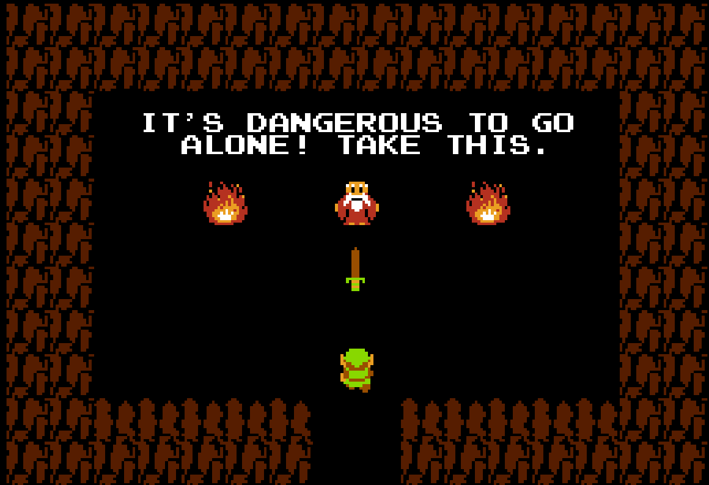
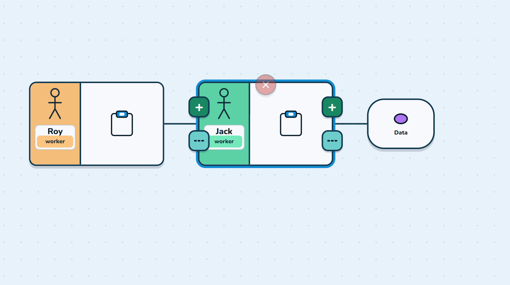
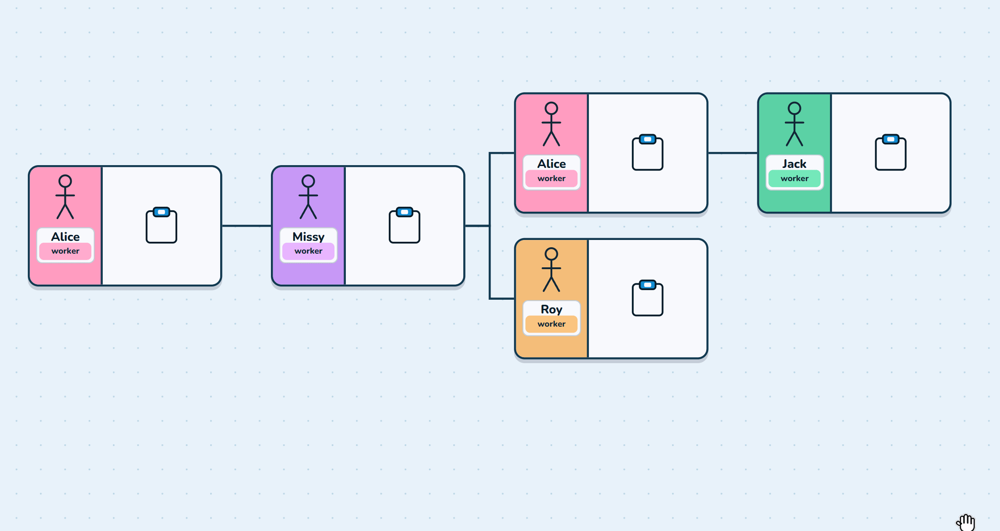
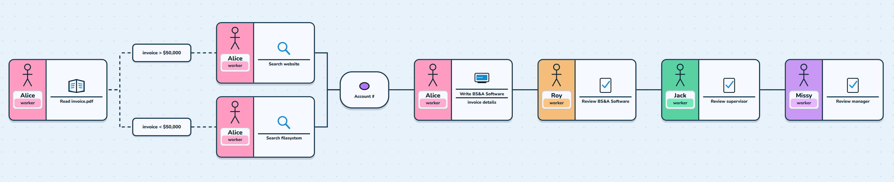
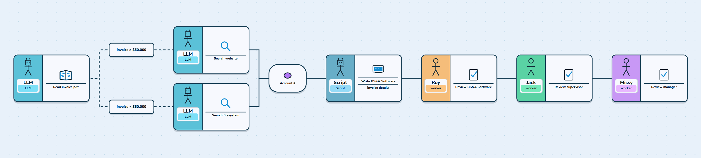

# Automation Workflow Illustrator

>*human written README, as always*

Software to help understand and visualize how a workflow could be modified from human to AI.

Goal is to be both **easy to use and easy to understand**.

Intended to help engineers and non-engineers get on the same page about what work steps can be automated.

<!-- TOC -->
<table width="100%">
<tr>
<td valign="middle" nowrap width="260">
<ul>
<li><a href="#usage">Usage</a></li>
<li><a href="#motivation">Motivation</a></li>
<li><a href="#agent-development-strategy">Agent Development Strategy</a>
<ul>
<li><a href="#visual-improvements">Visual improvements</a></li>
<li><a href="#third-party-leveraging">Third-Party Leveraging</a></li>
</ul>
</li>
<li><a href="#future-ideastodos">Future Ideas/TODOs</a>
<ul>
<li><a href="#features">Features</a></li>
<li><a href="#visual-improvements">Visual Improvements</a></li>
<li><a href="#anti-features">Anti-Features</a></li>
</ul>
</li>
</ul>
</td>
<td valign="middle">

</td>
</tr>
</table>
<!-- /TOC -->

---


### Usage

The **sound is off by default** but turning it on for the sound effects can make using the software more enjoyable.

```bash
docker pull ghcr.io/ashfordhill/automation-pitch:latest
docker run -p 8080:80 ghcr.io/ashfordhill/automation-pitch:latest
```

&nbsp;

---


### Motivation

Asked husband about one of his workflows as an employee in Oak Park Village.

City hires a contractor `->` contractor performs the work `->` contractor sends invoice to city.

Invoice goes through several steps before getting cleared to get paid:

- Invoice (usually PDF) must be parsed for contractor details.
- An account number that will be used to pay the contractor must be found. 
  - If the amount is over $50,000, the account number can usually be found in records online.
  - If the amount is under $50,000, the account number can usually be found in a shared drive within several folders.
- The data from steps 1 and 2 need to be added to a software called [BS&A](https://www.bsasoftware.com/).
- Once the BS&A entry is submitted, the request must be approved by several other employees using the same software.

It took some time to get enough details to illustrate his workflow. I tried to explain which parts could be automated but it was hard to describe verbally. 




The above workflow can be seen as a demo option in the current software, under **Oak Park Invoice**.

---

### Agent Development Strategy

I used Cursor and Grok 4.6 to do the majority of the work. With the Fable 5.1 credits I had, performed a very detailed build plan and rules for every future agent doing work.

I had each agent review documentation, perform their task, then append their own documentation. Then I would start another agent. I kept work scope moderate for each agent. The agent would perform screenshots with Playwright for any visual changes they did to be committed. 

#### Visual improvements

For visual improvements I would have the agent read screenshots, sketches and GIFs to help it understand what I was looking for visually. I also had the agents store this data as a visual record to show what was requested vs what was the result.

- This can be seen best in [.docs/VISUAL_IMPROVEMENTS.md](.docs/VISUAL_IMPROVEMENTS.md)

#### Third-Party Leveraging

I instructed the agents to search and look for third-party solutions where necessary. 

The [elkJS](https://github.com/kieler/elkjs) library did a lot of heavy lifting for the path creation algorithms (keeping the paths visually aligned and following certain rules when deleting and adding segments).

---

### Future Ideas/TODOs

#### Features

- **Export Scene As Image**
  - PNG, maybe SVG down the line. 
  - Support exporting before/after or compare view

- **Vertical Mode**
  - Comparison would also be left/right instead of top/bottom

- **Schema for Workflow Data**: Could use exported data format to build scaffolding in some sort of app creation software - to actually build the automation out for this. **Ideally leverage 3rd party solutions** instead of maintaining a custom solution from scratch.
  - E.g. - 'Read' task would align to a 'read' skill/script instead of creating over and over. 
  - E.g. - Could be simple and generate interfaces (TS prob) to implement. 
  - Uniformity could be nice when maintaining multiple solutions, can reuse e2e test patterns, etc.
  - *Might not be worth pursuing*

#### Visual Improvements

- **Custom Themes**: Multiple pre-made theme options and fully configurable custom themes
  - SVG icon presets would be nice as well
  - Export option for themes to a YAML/JSON

- **Sleeker Menu Options**
  - Having 4+ Actors could result in a `[[[[[]` pattern, like playing cards..?
    - Would save menu space but maybe would need a zoom when hovering over
    - Could get annoying > useful, even if visually stimulating
    - Having 4+ Actors might not be reasonable; generic Human/worker suffices
      - Mainly exists bc making personal examples could be a nice touch
  - Not sure what to do about the 'blank' right-hand menu only have the Actors button. Don't like it.

#### Anti-Features

Things I've considered/dropped.

- **Multiple root tiles (nodes)**: Possible to have 2 'islands' of workflows'
  - Introduces a lot of complexity; weakens feature of the before/after 1:1 and exporting. It's better to save each workflow segment as its own thing, I think. Microservice > monolith basically.

- **Merging Steps Feature**: In the 'After' section. Basically some new type of tile where it would show the eating up of multiple steps into 1, and owned by a Robot actor. 
  - This was confusing, hard to implement and I think it went against the spirit of showing workflows in broken-down, incremental steps.
- Double clicking text fields on the tiles to edit instead of the side menu
  - While convenient, it looked pretty bad. Would need a clever way to do this but typing on the side isn't the worst thing in the world for now.
    - Maybe could make some fields editable on the tile itself
